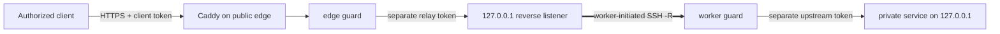

[English](README.md) · [العربية](i18n/README.ar.md) · [Español](i18n/README.es.md) · [Français](i18n/README.fr.md) · [日本語](i18n/README.ja.md) · [한국어](i18n/README.ko.md) · [Tiếng Việt](i18n/README.vi.md) · [中文 (简体)](i18n/README.zh-Hans.md) · [中文（繁體）](i18n/README.zh-Hant.md) · [Deutsch](i18n/README.de.md) · [Русский](i18n/README.ru.md)

[](https://github.com/lachlanchen/lachlanchen/blob/main/figs/banner.png)

# LazyEdge

*A small, auditable, default-deny edge that lets a public server safely use private compute.*

[](https://lazying.art) [](https://www.npmjs.com/package/@lazyingart/lazyedge) [](https://github.com/lachlanchen/LazyEdge/actions/workflows/ci.yml) [](package.json) [](LICENSE) [](https://github.com/sponsors/lachlanchen)

LazyEdge solves asymmetric reachability: your workstation can reach a cloud server, but the cloud server cannot dial back through home NAT. The worker opens an outbound OpenSSH reverse tunnel; the edge exposes only reviewed HTTPS host + method + path contracts through Caddy and two credential-separating guards. LocalLLM, Whisper, SoVITS, or another explicit HTTP service stays on local loopback.

> **Privacy promise:** **LazyEdge does not send telemetry, discover services, or expose an undeclared target. Only routes explicitly declared in the manifest can be generated. Request content travels only through the gateway and worker endpoints you configure, and LazyEdge does not persist request bodies.** Your configured proxy, journal, upstream, or cloud provider can have its own logging policy; read the [threat model](docs/security.md).

| Donate | PayPal | Stripe |
| --- | --- | --- |
| [](https://chat.lazying.art/donate) | [](https://paypal.me/RongzhouChen) | [](https://buy.stripe.com/aFadR8gIaflgfQV6T4fw400) |

## How it works



- **Outbound first:** the private worker initiates the connection; no home router port-forward is required.
- **Loopback throughout:** raw model, tunnel, worker, CDP, VNC, and noVNC ports are never public targets.
- **Exact policy:** domain, method, and path are allowlisted; undeclared traffic is denied at edge and worker.
- **Credential separation:** client, relay, upstream, and SSH credentials are different and stay outside the manifest.
- **Replaceable transport:** OpenSSH first; the application contract remains decoupled from future WireGuard, rathole, or frp transport.
- **Private service listeners:** an application-neutral authenticated loopback seam lets edge-local callers reach explicitly selected services without DNS, Caddy, TLS, or NAT exposure.
- **Migratable edge:** render the same reviewed project on a second cloud, connect it in parallel, test, then move DNS.

LazyEdge occupies the same problem space as an ngrok-style reverse tunnel, but it is intentionally narrower: the v0.2 preview exposes reviewed HTTP API routes, not arbitrary TCP ports or ad-hoc public URLs. See [concepts at scale](docs/concepts-at-scale.md) for the technology map.

## Quickstart

Node.js 20+ is required. Start locally; do not apply generated production files until you have read the plan and [security guide](docs/security.md).

```bash
npx @lazyingart/lazyedge --help
mkdir my-edge
cd my-edge
npx @lazyingart/lazyedge init --output lazyedge.yaml
npx @lazyingart/lazyedge validate --config ./lazyedge.yaml
npx @lazyingart/lazyedge plan --config ./lazyedge.yaml
```

Then render each artifact for review:

```bash
npx @lazyingart/lazyedge render caddy --config ./lazyedge.yaml
npx @lazyingart/lazyedge render openssh --config ./lazyedge.yaml \
  --identity-file "$HOME/.config/lazyedge/ssh/id_ed25519" \
  --known-hosts-file "$HOME/.config/lazyedge/ssh/known_hosts"
npx @lazyingart/lazyedge render accounts --config ./lazyedge.yaml \
  --public-key-file "$HOME/.config/lazyedge/ssh/id_ed25519.pub"
npx @lazyingart/lazyedge render systemd --config ./lazyedge.yaml
```

The Caddy command above uses Automatic HTTPS. Add `--manual-certificates` only for an existing Certbot `/etc/letsencrypt/live/<host>/` layout. The account renderer requires a dedicated Ed25519 public key; the OpenSSH paths refer to private worker files and do not copy their contents. The systemd command emits a labeled review bundle, or accepts `--component edge|worker|tunnel|caddy|redirect|certbot` for one section.

Keep runtime bindings split by trust boundary: copy the [edge example](examples/local-llm/bindings.edge.example.yaml) only to the public gateway and the [worker example](examples/local-llm/bindings.worker.example.yaml) only to private compute. The edge process reads the relay secret and external-client token store; the worker process reads the relay secret and private-upstream key. Neither role needs the other role's credential store.

After startup, run `doctor --role edge` on the cloud and `doctor --role worker` on private compute; use `all` only when both roles are genuinely co-located. Root-only `render redirect-helper` and `render nat --direction apply|rollback` commands print review artifacts with manifest-digest ownership tags—they never execute a firewall change. See [operations](docs/operations.md).

The `v1alpha1` interface is preview. Version 0.2 does not ship remote `apply`, `rollback`, or `uninstall`: renderers write reviewable artifacts, and an administrator installs them deliberately. See the complete [quickstart](docs/quickstart.md).

## What is included

| Path | Contents |
| --- | --- |
| [`bin/`](bin/) and [`src/`](src/) | CLI, manifest validation, guards, token lifecycle, and renderers |
| [`schemas/`](schemas/) | machine-readable `EdgeProject` contract |
| [`templates/`](templates/) | generated Caddy, OpenSSH, and systemd building blocks |
| [`examples/`](examples/) | secret-free LocalLLM and generic HTTP examples, including separate [edge](examples/local-llm/bindings.edge.example.yaml) and [worker](examples/local-llm/bindings.worker.example.yaml) bindings |
| [`docs/`](docs/) | architecture, security, operations, migration, and teaching guides |
| [`i18n/`](i18n/) | translated repository introductions |
| `references/private/` | ignored, npm-excluded, secret-free machine notes—not a credential store |

## Documentation

- [Architecture and request flow](docs/architecture.md)
- [Configuration reference](docs/configuration.md)
- [Security and threat model](docs/security.md)
- [Operations and rollback](docs/operations.md)
- [Upgrade v0.2 to the proposed transport-only v0.3](docs/upgrading-v0.2-to-v0.3.md)
- [Alibaba → Huawei or dual-edge migration](docs/migration.md)
- [OpenAI-compatible client integration](docs/integrations/openai-compatible-clients.md)
- [Application-neutral private service listeners](docs/private-service-listeners.md)
- [Troubleshooting](docs/troubleshooting.md)
- [How larger multi-server systems relate](docs/concepts-at-scale.md)

## Development and validation

```bash
npm ci
npm test
npm run check
npm run pack:dry-run
git diff --check
```

Inspect the npm dry-run file list. A release must not contain `references/private/`, `.env`, credentials, keys, tokens, logs, runtime state, browser profiles, or caches. Security-sensitive contributions should include a negative test; read [CONTRIBUTING.md](CONTRIBUTING.md) and [SECURITY.md](SECURITY.md).

## Citation

If you use LazyEdge in research, cite the repository. GitHub reads [CITATION.cff](CITATION.cff) and shows a **Cite this repository** panel on the repository page.

```bibtex
@software{chen_lazyedge_2026,
  author = {Chen, Lachlan},
  title = {LazyEdge: A default-deny edge for private compute},
  year = {2026},
  url = {https://github.com/lachlanchen/LazyEdge}
}
```

## Status

**v0.2 preview.** The public interface may change. This repository describes the intended safe baseline; it does not claim that any particular domain, cloud server, tunnel, npm version, or LocalLLM deployment is live until that environment is independently verified. Do not use LazyEdge as the only control protecting sensitive or safety-critical systems.

MIT © [Lachlan Chen](https://github.com/lachlanchen)
