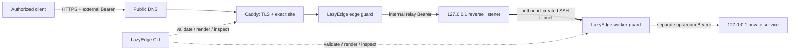

# Architecture

LazyEdge gives a public server a narrow, authenticated route to a service on a private machine. The private worker initiates the connection, so the cloud host never needs to discover or dial into the worker's home network.

## Request path

1. DNS sends an approved hostname to the public edge.
2. Caddy terminates TLS and proxies only the configured site. Caddy can automate certificate management and redirect HTTP to HTTPS; see [Automatic HTTPS](https://caddyserver.com/docs/automatic-https) and the [`reverse_proxy` directive](https://caddyserver.com/docs/caddyfile/directives/reverse_proxy).
3. The edge guard checks the external Bearer token, hostname, method, path, body limit, and concurrency contract. Anything not declared is denied.
4. The edge guard removes the external credential and injects a different internal relay credential.
5. An OpenSSH remote forward carries the request through a listener bound to cloud loopback. In OpenSSH, `-R` creates a remote forward; bind behavior is governed by `GatewayPorts`. See [`ssh(1)`](https://man.openbsd.org/ssh.1) and [`sshd_config(5)`](https://man.openbsd.org/sshd_config).
6. The worker guard validates and removes the relay credential, repeats the route checks, and injects the private service's distinct Bearer credential.
7. The local service answers. Its port never becomes a public listener.

Caddy itself supports streaming responses and WebSocket upgrades, but the v0.4 preview intentionally strips `Upgrade` and implements HTTP/SSE only. End-to-end WebSocket forwarding is not part of the current contract. LazyEdge applies the declared route and resource limits before HTTP traffic reaches a worker. See the [Caddy reverse proxy documentation](https://caddyserver.com/docs/caddyfile/directives/reverse_proxy).

## Components and trust zones

| Component | Typical host | Public? | Responsibility |
| --- | --- | --- | --- |
| Caddy | cloud edge | ports 80/443 | TLS, hostname routing, public HTTP entry |
| edge guard | cloud edge | no; loopback/upstream only | external auth, exact route enforcement, limits |
| reverse listener | cloud edge | no; `127.0.0.1` only | tunnel rendezvous point |
| SSH client | private worker | outbound only | maintains the remote forward |
| worker guard | private worker | no; loopback only | relay auth, duplicate policy, upstream auth |
| private service | private worker | no; loopback only | LocalLLM, Whisper, SoVITS, or another approved API |

The default transport is OpenSSH because it is widely available, inspectable, and sufficient for a small number of workers. [WireGuard](https://www.wireguard.com/) is a good future transport when many private services should share one routed overlay. [rathole](https://github.com/rathole-org/rathole) and [frp](https://gofrp.org/en/docs/overview/) are purpose-built reverse-tunnel alternatives. LazyEdge treats transport as replaceable; the route and authentication contract stays above it.

## Control plane and data plane

The CLI is the control plane: it validates a declarative `EdgeProject`, computes a plan, renders native configuration, manages capability-token lifecycle, and starts the guards. Version 0.4 leaves remote installation and rollback to the administrator. It is not a hosted coordinator and does not scan networks for services.

The separate rollout safety libraries are controller-building primitives, not an
expansion of that control plane. Their CLI commands only normalize and digest an
`EdgeRollout` or inspect an existing journal. They do not verify live artifacts,
execute a transition, stop a unit, or render an automatic rollback service. The
embedding application retains those actions and must couple any consumed stop
authorization to the current PID, Linux process start ticks, and systemd
`InvocationID`. See [rollout safety](rollout-safety.md).

The opt-in `localllm-openai-admission` profile adds a bounded application
predicate, not a fleet control plane. It exposes only authenticated exact
`GET /readyz` and `GET /api/node/capabilities` claims and lets the worker doctor
validate catalog readiness plus fresh release-bound canary evidence. LazyEdge
does not enroll nodes, retain capabilities, choose assignments, count workers,
or own switch/migration/removal state. A separate coordinator may consume the
predicate and remains responsible for those decisions and their rollback.

Caddy, the two guards, and the tunnel form the data plane. A request can flow only while all of them are healthy. Keeping these roles separate makes migration possible: create a second edge, connect the same worker, test it, then change DNS.

Runtime bindings preserve the same split. The edge loads only its relay secret and external-client token store; it never opens the private-upstream key. The worker loads only its relay secret and upstream key; it never opens the client token store. Use separate bindings files on the two hosts so an accidental copy does not broaden either host's credential set.

## Optional loopback compatibility listener

`spec.edge.compatibilityListen` reserves a loopback-only adapter for an existing application on the same cloud host. It is useful when that application should call a selected LazyEdge service without going out through public DNS. The adapter still requires an external Bearer token for every public API route, including the two opt-in admission documents, replaces it with the relay credential, and applies the same exact method/path policy. Its unauthenticated health endpoint is loopback-only, relays only the configured private transport-health check, and is never node admission.

This is not a bypass and must never bind to a public or LAN address. When multiple services exist, the supervising unit selects one explicit service ID for each compatibility listener.

## Application-neutral private service listeners

`spec.edge.privateListeners` is the multi-service cloud-local seam. Each exact
loopback listener selects one private manifest service before startup and
accepts only that service's external token set, method/path claims and resource limits. It
then injects only the selected relay capability and follows the same reverse
listener and worker-guard chain. Host headers, queries and CLI options cannot
select or redirect a private listener.

A service with `exposure: private` has `domains: []`, must own one private
listener and is omitted from Caddy, certificate and NAT ingress. A public
service cannot own a private listener because the two ingresses require
separate credential audiences. Public remains the default exposure and keeps
the existing non-empty domain contract. A
private-only project supervises the edge listener, tunnel and worker without
generating public-ingress lifecycle artifacts. See [private service
listeners](private-service-listeners.md) for the exact manifest and acceptance
boundary.

## Default-deny contract

Each service names an exposure, zero or more exposure-valid domains, one edge-side loopback upstream, one worker listener, one loopback target, a token set, and exact HTTP routes. Wildcard target hosts, arbitrary TCP destinations, raw management ports, CDP, VNC, and noVNC are outside the design.

Read [configuration](configuration.md) for the manifest contract and [security](security.md) for assumptions and limits.
