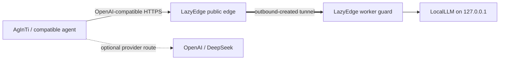

# LocalLLM and AgInTi

LazyEdge can give an agent a stable HTTPS model endpoint while inference remains on a private GPU workstation. The model server, agent runtime, and edge remain separate projects and can be upgraded or replaced independently.



## Recommended boundary

- LocalLLM listens on workstation loopback, for example `127.0.0.1:8008`.
- The worker guard targets that exact endpoint; no model-management or debug port is routed.
- The manifest allows only the API paths and methods required by the client, such as `POST /v1/chat/completions` and a deliberately reviewed health path.
- The client sends an external LazyEdge token over HTTPS.
- LazyEdge replaces that token at each boundary; the LocalLLM API key remains only on the worker.
- AgInTi selects the stable OpenAI-compatible base URL and can retain separate OpenAI or DeepSeek providers as quality/capacity fallbacks.

The public API token is not the model server's administrative token. Do not publish model-management, shell, file, debug, metrics, CDP, VNC, or noVNC endpoints.

If the LocalLLM project already keeps `LOCALLLM_API_KEY` in a private `.env`, follow the [`secret import-env` quickstart](../quickstart.md) to create the worker's separate upstream secret file without changing LocalLLM or printing the value.

During a later key rotation, `secret sync-env --env-file FILE --name LOCALLLM_API_KEY --value-file FILE` can atomically synchronize the proposed worker-only key into LocalLLM's private `.env`. LazyEdge does not back up that file, restart LocalLLM, confirm it loaded the value, or roll it back. The operator must follow the full [upstream-key rotation runbook](../operations.md#upstream-key-rotation), including a protected backup, an owning-service restart, proof that the new key works, proof that the old key is denied, and restoration from backup on failure.

## Example manifest shape

This is a structural example. Run it through the version of `lazyedge validate` you install, because the `v1alpha1` schema may change before a stable release.

```yaml
apiVersion: lazyedge.lazying.art/v1alpha1
kind: EdgeProject
metadata:
  name: personal-llm
spec:
  edge:
    gatewayListen: 127.0.0.1:7443
  transport:
    provider: openssh-reverse
    sshHost: edge.example.com
    sshUser: lazyedge-tunnel
  services:
    - id: localllm
      profile: localllm-openai
      domains:
        - llm.example.com
      edge:
        upstream: http://127.0.0.1:18008
      worker:
        listen: 127.0.0.1:28008
        target: http://127.0.0.1:8008
        healthPath: /health
      public:
        tokenSet: personal-agents
        maxBodyBytes: 1048576
        maxConcurrentRequests: 2
        routes:
          - path: /v1/chat/completions
            methods: [POST]
```

Secrets referenced by `tokenSet`, relay authentication, and upstream authentication belong in separate owner-readable runtime stores, never in this manifest. Use the [edge bindings example](../../examples/local-llm/bindings.edge.example.yaml) only on the gateway and the [worker bindings example](../../examples/local-llm/bindings.worker.example.yaml) only on private compute.

## Agent configuration

Configure the agent's OpenAI-compatible provider with:

```text
base URL: https://llm.example.com/v1
API token: <external LazyEdge client token>
model: <a model name served by LocalLLM>
```

Environment variable names differ among AgInTi versions and other clients. Use that client's documented provider settings rather than copying a secret-bearing shell command into history. A robust agent policy should route tasks the local model can handle locally, keep tool and permission enforcement outside model text, and escalate only when task difficulty or validation requires a stronger provider.

## Local-first AgInTi policy

Keep provider selection in AgInTi rather than in LazyEdge. A useful policy is:

1. make the LocalLLM provider the default for bounded drafting, extraction, classification, code navigation, and tool-plan steps that it passes in evaluation;
2. advertise the real model name, context limit, structured-output/tool-call support, and measured concurrency instead of assuming capabilities from parameter count;
3. let the agent runtime validate tool arguments, permissions, file effects, and completion evidence—model text is never an authorization boundary;
4. retry malformed structured output with a compact repair prompt and a strict limit, then escalate instead of looping indefinitely;
5. keep OpenAI and DeepSeek as independent provider adapters for tasks that exceed the local evaluation threshold, require a larger context, or repeatedly fail validation.

This preserves the intended decoupling: LocalLLM owns inference, AgInTi owns agent policy and tools, and LazyEdge owns narrow authenticated connectivity. Replacing any one layer does not require merging repositories or moving model weights.

## Capacity and timeouts

Local inference is slower and more variable than ordinary web APIs. Set a small concurrency limit based on measured GPU memory, allow streaming, and align client, Caddy, edge, worker, and model-server timeouts. Queue work in the agent layer if the model server does not provide safe admission control.

Test with one representative prompt, one streaming response, a cancelled request, an oversized body, concurrent requests, a stopped tunnel, and an invalid token. Do not claim maximum model capacity from parameter count alone; benchmark the exact quantization, context, GPU offload, and workload.
