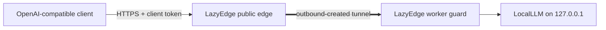

# OpenAI-compatible clients

LazyEdge can give an OpenAI-compatible client a stable HTTPS model endpoint
while inference remains on a private GPU workstation. The model server, client,
and edge remain separate projects and can be upgraded or replaced independently.



## Recommended boundary

- LocalLLM listens on workstation loopback, for example `127.0.0.1:8008`.
- The worker guard targets that exact endpoint; no model-management or debug
  port is routed.
- The manifest allows only the API paths and methods required by the client,
  such as `POST /v1/chat/completions` and a deliberately reviewed health path.
- The client sends an external LazyEdge token over HTTPS.
- LazyEdge replaces that token at each boundary; the LocalLLM API key remains
  only on the worker.
- Provider selection, retries, model choice, and application behavior remain in
  the client rather than in LazyEdge.

The public API token is not the model server's administrative token. Do not
publish model-management, shell, file, debug, metrics, CDP, VNC, or noVNC
endpoints.

If the LocalLLM project already keeps `LOCALLLM_API_KEY` in a private `.env`,
follow the [`secret import-env` quickstart](../quickstart.md) to create the
worker's separate upstream secret file without changing LocalLLM or printing the
value.

During a later key rotation, `secret sync-env --env-file FILE --name
LOCALLLM_API_KEY --value-file FILE` can atomically synchronize the proposed
worker-only key into LocalLLM's private `.env`. LazyEdge does not back up that
file, restart LocalLLM, confirm it loaded the value, or roll it back. The
operator must follow the full [upstream-key rotation
runbook](../operations.md#upstream-key-rotation), including a protected backup,
an owning-service restart, proof that the new key works, proof that the old key
is denied, and restoration from backup on failure.

## Example manifest shape

This is a structural example. Run it through the version of `lazyedge validate`
you install, because the `v1alpha1` schema may change before a stable release.

```yaml
apiVersion: lazyedge.lazying.art/v1alpha1
kind: EdgeProject
metadata:
  name: personal-llm
spec:
  edge:
    gatewayListen: 127.0.0.1:7443
  transport:
    provider: openssh-reverse
    sshHost: edge.example.com
    sshUser: lazyedge-tunnel
  services:
    - id: localllm
      profile: localllm-openai
      domains:
        - llm.example.com
      edge:
        upstream: http://127.0.0.1:18008
      worker:
        listen: 127.0.0.1:28008
        target: http://127.0.0.1:8008
        healthPath: /health
      public:
        tokenSet: model-api-users
        maxBodyBytes: 1048576
        maxConcurrentRequests: 2
        routes:
          - path: /v1/chat/completions
            methods: [POST]
```

Secrets referenced by `tokenSet`, relay authentication, and upstream
authentication belong in separate owner-readable runtime stores, never in this
manifest. Use the [edge bindings
example](../../examples/local-llm/bindings.edge.example.yaml) only on the gateway
and the [worker bindings
example](../../examples/local-llm/bindings.worker.example.yaml) only on private
compute.

## Client configuration

Configure the client's OpenAI-compatible provider with:

```text
base URL: https://llm.example.com/v1
API token: <external LazyEdge client token>
model: <a model name served by LocalLLM>
```

Environment variable and settings names differ among clients. Use the client's
documented configuration rather than copying a secret-bearing shell command
into history. Keep tool permissions, file effects, and other application policy
outside model text; model output is never an authorization boundary.

## Capacity and timeouts

Local inference is slower and more variable than ordinary web APIs. Set a small
concurrency limit based on measured GPU memory, allow streaming, and align
client, Caddy, edge, worker, and model-server timeouts. Put any required queue or
admission policy in the client or model service; LazyEdge enforces only the
declared transport limits.

Test with one representative request, one streaming response, a cancelled
request, an oversized body, concurrent requests, a stopped tunnel, and an
invalid token. Do not claim maximum model capacity from parameter count alone;
benchmark the exact quantization, context, GPU offload, and workload.
