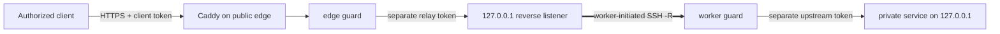

[English](../README.md) · [العربية](README.ar.md) · [Español](README.es.md) · [Français](README.fr.md) · [日本語](README.ja.md) · [한국어](README.ko.md) · [Tiếng Việt](README.vi.md) · [中文 (简体)](README.zh-Hans.md) · [中文（繁體）](README.zh-Hant.md) · [Deutsch](README.de.md) · [Русский](README.ru.md)

[](https://github.com/lachlanchen/lachlanchen/blob/main/figs/banner.png)

# LazyEdge

*بوابة صغيرة، قابلة للتدقيق، ومغلقة افتراضيًا، تتيح لخادم عام استخدام حوسبة خاصة بأمان.*

[](https://lazying.art) [](https://www.npmjs.com/package/@lazyingart/lazyedge) [](https://github.com/lachlanchen/LazyEdge/actions/workflows/ci.yml) [](../package.json) [](../LICENSE) [](https://github.com/sponsors/lachlanchen)

يعالج LazyEdge عدم تماثل الوصول: تستطيع محطة العمل الوصول إلى خادم سحابي، لكن الخادم لا يستطيع الاتصال عكسيًا عبر NAT المنزلي. يفتح العامل نفق OpenSSH عكسيًا صادرًا، ولا تعرض الحافة إلا عقود HTTPS مُراجعة بدقة حسب المضيف والطريقة والمسار، عبر Caddy وحارسين يفصلان بيانات الاعتماد. تبقى خدمات LocalLLM وWhisper وSoVITS وأي خدمة HTTP مصرّح بها على واجهة loopback المحلية.

> **وعد الخصوصية:** **لا يرسل LazyEdge بيانات قياس عن بُعد، ولا يكتشف الخدمات، ولا يكشف هدفًا غير معلن. لا يمكن إنشاء سوى المسارات المصرّح بها صراحة في ملف التعريف. يمر محتوى الطلب فقط عبر نقاط الحافة والعامل التي تضبطها، ولا يحفظ LazyEdge أجسام الطلبات.** قد تكون للوكيل أو سجل النظام أو الخدمة الخلفية أو مزود السحابة سياسة تسجيل خاصة به؛ اقرأ [نموذج التهديد](../docs/security.md).

| Donate | PayPal | Stripe |
| --- | --- | --- |
| [](https://chat.lazying.art/donate) | [](https://paypal.me/RongzhouChen) | [](https://buy.stripe.com/aFadR8gIaflgfQV6T4fw400) |

## آلية العمل



- **الاتصال الصادر أولًا:** يبدأ العامل الخاص الاتصال؛ لا حاجة إلى فتح منفذ في موجّه المنزل.
- **Loopback في كل الحدود:** لا تصبح منافذ النموذج الخام أو النفق أو العامل أو CDP أو VNC أو noVNC أهدافًا عامة.
- **سياسة دقيقة:** تُدرج أسماء النطاقات والطرق والمسارات في قائمة سماح؛ ويُرفض كل ما لم يُعلن عند الحافة والعامل.
- **فصل بيانات الاعتماد:** رموز العميل والترحيل والخدمة الخلفية ومفاتيح SSH مختلفة وتبقى خارج ملف التعريف.
- **ناقل قابل للاستبدال:** يبدأ المشروع بـ OpenSSH، بينما يبقى عقد التطبيق منفصلًا عن WireGuard أو rathole أو frp مستقبلًا.
- **حافة قابلة للنقل:** ولّد المشروع نفسه على سحابة ثانية، وصِلها بالتوازي، واختبرها، ثم انقل DNS.

يعمل LazyEdge في مجال شبيه بنفق عكسي على غرار ngrok، لكنه أضيق عمدًا: يعرض الإصدار التجريبي v0.3 مسارات HTTP API مُراجعة، لا منافذ TCP عشوائية ولا عناوين عامة مؤقتة. راجع [المفاهيم على نطاق واسع](../docs/concepts-at-scale.md) لخريطة التقنيات.

## البدء السريع

يتطلب Node.js 20 أو أحدث. ابدأ محليًا، ولا تطبّق ملفات الإنتاج المولّدة قبل مراجعة الخطة و[دليل الأمان](../docs/security.md).

```bash
npx @lazyingart/lazyedge --help
mkdir my-edge
cd my-edge
npx @lazyingart/lazyedge init --output lazyedge.yaml
npx @lazyingart/lazyedge validate --config ./lazyedge.yaml
npx @lazyingart/lazyedge plan --config ./lazyedge.yaml
```

ثم ولّد كل ملف لمراجعته:

```bash
npx @lazyingart/lazyedge render caddy --config ./lazyedge.yaml
npx @lazyingart/lazyedge render openssh --config ./lazyedge.yaml \
  --identity-file "$HOME/.config/lazyedge/ssh/id_ed25519" \
  --known-hosts-file "$HOME/.config/lazyedge/ssh/known_hosts"
npx @lazyingart/lazyedge render accounts --config ./lazyedge.yaml \
  --public-key-file "$HOME/.config/lazyedge/ssh/id_ed25519.pub"
npx @lazyingart/lazyedge render systemd --config ./lazyedge.yaml
```

يستخدم أمر Caddy أعلاه HTTPS التلقائي. أضف `--manual-certificates` فقط عند وجود بنية Certbot سابقة في `/etc/letsencrypt/live/<host>/`. يتطلب مولّد الحساب مفتاح Ed25519 عامًا مخصصًا؛ وتشير مسارات OpenSSH إلى ملفات العامل الخاصة من دون نسخ محتواها. يُخرج أمر systemd حزمة مراجعة بعناوين، أو يقبل `--component edge|worker|tunnel|caddy|redirect|certbot` لقسم واحد.

افصل ملفات الربط حسب حدود الثقة: ضع [مثال edge](../examples/local-llm/bindings.edge.example.yaml) على البوابة العامة فقط، و[مثال worker](../examples/local-llm/bindings.worker.example.yaml) على الحوسبة الخاصة فقط. يقرأ كل تشغيل أسرار دوره وحدها؛ لا يحتاج أي طرف إلى مخزن بيانات اعتماد الطرف الآخر.

بعد التشغيل، نفّذ `doctor --role edge` على السحابة و`doctor --role worker` على الحوسبة الخاصة؛ استخدم `all` فقط عندما تكون الوظيفتان على المضيف نفسه فعلًا. تطبع أوامر الجذر `render redirect-helper` و`render nat --direction apply|rollback` ملفات مراجعة موسومة بملخص ملف التعريف، ولا تنفذ تغييرًا في الجدار الناري. راجع [دليل التشغيل](../docs/operations.md).

واجهة `v1alpha1` تجريبية. لا يتضمن الإصدار 0.3 أوامر `apply` أو `rollback` أو `uninstall` عن بُعد؛ تكتب المولّدات ملفات قابلة للمراجعة، ويثبتها المسؤول بشكل مقصود. راجع [دليل البدء الكامل](../docs/quickstart.md).

## محتويات المشروع

| المسار | المحتوى |
| --- | --- |
| [`bin/`](../bin/) و[`src/`](../src/) | CLI، والتحقق من الملف، والحراس، ودورة حياة الرموز، والمولّدات |
| [`schemas/`](../schemas/) | عقد `EdgeProject` المقروء آليًا |
| [`templates/`](../templates/) | لبنات Caddy وOpenSSH وsystemd المولّدة |
| [`examples/`](../examples/) | أمثلة خالية من الأسرار لـ LocalLLM وHTTP عام، مع ملفات ربط منفصلة لـ [edge](../examples/local-llm/bindings.edge.example.yaml) و[worker](../examples/local-llm/bindings.worker.example.yaml) |
| [`docs/`](../docs/) | أدلة البنية والأمان والتشغيل والنقل والتعليم |
| [`i18n/`](../i18n/) | مقدمات المشروع المترجمة |
| `references/private/` | ملاحظات أجهزة خالية من الأسرار، مستبعدة من Git وnpm؛ وليست مخزن بيانات اعتماد |

## التوثيق

- [البنية ومسار الطلب](../docs/architecture.md)
- [مرجع الإعداد](../docs/configuration.md)
- [الأمان ونموذج التهديد](../docs/security.md)
- [التشغيل والتراجع](../docs/operations.md)
- [النقل من Alibaba إلى Huawei أو تشغيل حافتين](../docs/migration.md)
- [عملاء متوافقون مع OpenAI](../docs/integrations/openai-compatible-clients.md)
- [استكشاف الأخطاء](../docs/troubleshooting.md)
- [علاقة الأنظمة الكبيرة متعددة الخوادم](../docs/concepts-at-scale.md)

## التطوير والتحقق

```bash
npm ci
npm test
npm run check
npm run pack:dry-run
git diff --check
```

افحص قائمة ملفات حزمة npm التجريبية. يجب ألا يحتوي الإصدار على `references/private/` أو `.env` أو بيانات اعتماد أو مفاتيح أو رموز أو سجلات أو حالة تشغيل أو ملفات تعريف متصفح أو ذاكرة مؤقتة. ينبغي أن تتضمن المساهمات الحساسة أمنيًا اختبارًا سلبيًا؛ اقرأ [دليل المساهمة](../CONTRIBUTING.md) و[سياسة الأمان](../SECURITY.md).

## الاستشهاد

إذا استخدمت LazyEdge في بحث، فاستشهد بالمستودع. يقرأ GitHub ملف [CITATION.cff](../CITATION.cff) ويعرض لوحة **Cite this repository** في صفحة المستودع.

```bibtex
@software{chen_lazyedge_2026,
  author = {Chen, Lachlan},
  title = {LazyEdge: A default-deny edge for private compute},
  year = {2026},
  url = {https://github.com/lachlanchen/LazyEdge}
}
```

## الحالة

**معاينة v0.3.** قد تتغير الواجهة العامة. يصف هذا المستودع خط الأساس الآمن المقصود؛ ولا يزعم أن نطاقًا أو خادمًا سحابيًا أو نفقًا أو إصدار npm أو نشر LocalLLM بعينه يعمل قبل التحقق المستقل من تلك البيئة. لا تستخدم LazyEdge كوسيلة الحماية الوحيدة للأنظمة الحساسة أو الحرجة للسلامة.

MIT © [Lachlan Chen](https://github.com/lachlanchen)
