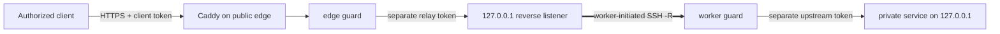

[English](../README.md) · [العربية](README.ar.md) · [Español](README.es.md) · [Français](README.fr.md) · [日本語](README.ja.md) · [한국어](README.ko.md) · [Tiếng Việt](README.vi.md) · [中文 (简体)](README.zh-Hans.md) · [中文（繁體）](README.zh-Hant.md) · [Deutsch](README.de.md) · [Русский](README.ru.md)

[](https://github.com/lachlanchen/lachlanchen/blob/main/figs/banner.png)

# LazyEdge

*Ein kleiner, prüfbarer und standardmäßig geschlossener Edge-Dienst, mit dem ein öffentlicher Server private Rechenleistung sicher nutzen kann.*

[](https://lazying.art) [](https://www.npmjs.com/package/@lazyingart/lazyedge) [](https://github.com/lachlanchen/LazyEdge/actions/workflows/ci.yml) [](../package.json) [](../LICENSE) [](https://github.com/sponsors/lachlanchen)

LazyEdge löst asymmetrische Erreichbarkeit: Ihre Workstation kann einen Cloud-Server erreichen, der Server kann jedoch nicht durch das Heim-NAT zurückrufen. Der private Worker öffnet einen ausgehenden OpenSSH-Reverse-Tunnel; der Edge veröffentlicht über Caddy und zwei Wächter mit getrennten Zugangsdaten ausschließlich geprüfte HTTPS-Verträge aus Host + Methode + Pfad. LocalLLM, Whisper, SoVITS oder ein anderer ausdrücklich zugelassener HTTP-Dienst bleibt auf dem lokalen Loopback.

> **Datenschutzversprechen:** **LazyEdge sendet keine Telemetrie, sucht nicht selbstständig nach Diensten und veröffentlicht kein nicht deklariertes Ziel. Nur ausdrücklich im Manifest deklarierte Routen können erzeugt werden. Anfrageinhalte durchlaufen ausschließlich die von Ihnen konfigurierten Gateway- und Worker-Endpunkte; LazyEdge speichert keine Anfragekörper dauerhaft.** Der konfigurierte Proxy, das Systemjournal, der Upstream-Dienst oder Cloud-Anbieter kann eigene Protokollierungsregeln haben; lesen Sie das [Bedrohungsmodell](../docs/security.md).

| Donate | PayPal | Stripe |
| --- | --- | --- |
| [](https://chat.lazying.art/donate) | [](https://paypal.me/RongzhouChen) | [](https://buy.stripe.com/aFadR8gIaflgfQV6T4fw400) |

## Funktionsweise



- **Ausgehend zuerst:** Der private Worker initiiert die Verbindung; eine Portweiterleitung am Heimrouter ist nicht nötig.
- **Loopback an jeder Grenze:** Rohe Modell-, Tunnel-, Worker-, CDP-, VNC- und noVNC-Ports werden niemals öffentliche Ziele.
- **Exakte Richtlinie:** Domain, Methode und Pfad werden ausdrücklich zugelassen; Edge und Worker verweigern alles Nichtdeklarierte.
- **Getrennte Zugangsdaten:** Client-, Relay-, Upstream- und SSH-Zugangsdaten sind verschieden und bleiben außerhalb des Manifests.
- **Austauschbarer Transport:** Zunächst OpenSSH; der Anwendungsvertrag bleibt von künftigem WireGuard-, rathole- oder frp-Transport entkoppelt.
- **Migrierbarer Edge:** Erzeugen Sie dasselbe geprüfte Projekt in einer zweiten Cloud, verbinden und testen Sie es parallel und verschieben Sie danach DNS.

LazyEdge löst einen ähnlichen Bedarf wie ein ngrok-artiger Reverse-Tunnel, ist aber absichtlich enger gefasst: v0.1 veröffentlicht geprüfte HTTP-API-Routen, keine beliebigen TCP-Ports oder spontanen öffentlichen URLs. Die technische Einordnung finden Sie unter [Konzepte im großen Maßstab](../docs/concepts-at-scale.md).

## Schnellstart

Node.js 20 oder neuer ist erforderlich. Beginnen Sie lokal; wenden Sie erzeugte Produktionsdateien erst an, nachdem Sie den Plan und den [Sicherheitsleitfaden](../docs/security.md) gelesen haben.

```bash
npx @lazyingart/lazyedge --help
mkdir my-edge
cd my-edge
npx @lazyingart/lazyedge init --output lazyedge.yaml
npx @lazyingart/lazyedge validate --config ./lazyedge.yaml
npx @lazyingart/lazyedge plan --config ./lazyedge.yaml
```

Erzeugen Sie danach jedes Artefakt zur Prüfung:

```bash
npx @lazyingart/lazyedge render caddy --config ./lazyedge.yaml
npx @lazyingart/lazyedge render openssh --config ./lazyedge.yaml \
  --identity-file "$HOME/.config/lazyedge/ssh/id_ed25519" \
  --known-hosts-file "$HOME/.config/lazyedge/ssh/known_hosts"
npx @lazyingart/lazyedge render accounts --config ./lazyedge.yaml \
  --public-key-file "$HOME/.config/lazyedge/ssh/id_ed25519.pub"
npx @lazyingart/lazyedge render systemd --config ./lazyedge.yaml
```

Der obige Caddy-Befehl verwendet Automatic HTTPS. Ergänzen Sie `--manual-certificates` nur für eine vorhandene Certbot-Struktur unter `/etc/letsencrypt/live/<host>/`. Der Account-Renderer benötigt einen eigenen öffentlichen Ed25519-Schlüssel; die OpenSSH-Pfade verweisen auf private Worker-Dateien, ohne deren Inhalt zu kopieren. Der systemd-Befehl erzeugt ein beschriftetes Prüfbündel oder mit `--component edge|worker|tunnel|caddy|redirect|certbot` einen einzelnen Abschnitt.

Trennen Sie Bindings nach Vertrauensgrenze: Legen Sie das [Edge-Beispiel](../examples/local-llm/bindings.edge.example.yaml) nur auf dem öffentlichen Gateway und das [Worker-Beispiel](../examples/local-llm/bindings.worker.example.yaml) nur auf dem privaten Rechner ab. Jeder Prozess liest ausschließlich die Anmeldedaten seiner Rolle; keine Rolle benötigt den Credential-Store der anderen.

Führen Sie nach dem Start `doctor --role edge` in der Cloud und `doctor --role worker` auf dem privaten Rechner aus; verwenden Sie `all` nur bei tatsächlich gemeinsamem Host. Die root-spezifischen Befehle `render redirect-helper` und `render nat --direction apply|rollback` geben lediglich Prüfarbeitsstände mit einer aus dem Manifest-Digest abgeleiteten Eigentumsmarke aus und ändern nie die Firewall. Siehe [Betrieb](../docs/operations.md).

Die Schnittstelle `v1alpha1` ist eine Vorschau. Version 0.1 liefert kein entferntes `apply`, `rollback` oder `uninstall`: Renderer schreiben prüfbare Artefakte, die ein Administrator bewusst installiert. Siehe den [vollständigen Schnellstart](../docs/quickstart.md).

## Inhalt

| Pfad | Inhalt |
| --- | --- |
| [`bin/`](../bin/) und [`src/`](../src/) | CLI, Manifestprüfung, Wächter, Token-Lebenszyklus und Renderer |
| [`schemas/`](../schemas/) | maschinenlesbarer `EdgeProject`-Vertrag |
| [`templates/`](../templates/) | erzeugte Bausteine für Caddy, OpenSSH und systemd |
| [`examples/`](../examples/) | geheimnisfreie Beispiele für LocalLLM und generisches HTTP mit getrennten Bindings für [Edge](../examples/local-llm/bindings.edge.example.yaml) und [Worker](../examples/local-llm/bindings.worker.example.yaml) |
| [`docs/`](../docs/) | Leitfäden zu Architektur, Sicherheit, Betrieb, Migration und Grundlagen |
| [`i18n/`](../i18n/) | übersetzte Projekteinstiege |
| `references/private/` | von Git ignorierte und aus npm ausgeschlossene, geheimnisfreie Maschinennotizen; kein Zugangsdaten-Speicher |

## Dokumentation

- [Architektur und Anfrageweg](../docs/architecture.md)
- [Konfigurationsreferenz](../docs/configuration.md)
- [Sicherheit und Bedrohungsmodell](../docs/security.md)
- [Betrieb und Rollback](../docs/operations.md)
- [Migration Alibaba → Huawei oder Dual-Edge](../docs/migration.md)
- [Integration von LocalLLM + AgInTi](../docs/integrations/local-llm-aginti.md)
- [Fehlerbehebung](../docs/troubleshooting.md)
- [Bezug zu großen Mehrserversystemen](../docs/concepts-at-scale.md)

## Entwicklung und Prüfung

```bash
npm ci
npm test
npm run check
npm run pack:dry-run
git diff --check
```

Prüfen Sie die Dateiliste des npm-Testpakets. Eine Veröffentlichung darf weder `references/private/` noch `.env`, Zugangsdaten, Schlüssel, Tokens, Protokolle, Laufzeitstatus, Browserprofile oder Caches enthalten. Sicherheitsrelevante Beiträge sollten einen Negativtest enthalten; lesen Sie [CONTRIBUTING.md](../CONTRIBUTING.md) und [SECURITY.md](../SECURITY.md).

## Zitieren

Wenn Sie LazyEdge in der Forschung verwenden, zitieren Sie das Repository. GitHub liest [CITATION.cff](../CITATION.cff) und zeigt auf der Repository-Seite den Bereich **Cite this repository** an.

```bibtex
@software{chen_lazyedge_2026,
  author = {Chen, Lachlan},
  title = {LazyEdge: A default-deny edge for private compute},
  year = {2026},
  url = {https://github.com/lachlanchen/LazyEdge}
}
```

## Status

**v0.1-Vorschau.** Die öffentliche Schnittstelle kann sich ändern. Dieses Repository beschreibt die beabsichtigte sichere Grundlage; es behauptet nicht, dass eine bestimmte Domain, ein Cloud-Server, Tunnel, npm-Paket oder eine LocalLLM-Bereitstellung aktiv ist, bevor diese Umgebung unabhängig geprüft wurde. Verwenden Sie LazyEdge nicht als alleinige Schutzmaßnahme für sensible oder sicherheitskritische Systeme.

MIT © [Lachlan Chen](https://github.com/lachlanchen)
