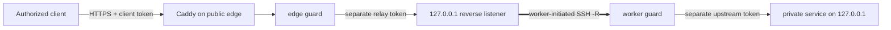

[English](../README.md) · [العربية](README.ar.md) · [Español](README.es.md) · [Français](README.fr.md) · [日本語](README.ja.md) · [한국어](README.ko.md) · [Tiếng Việt](README.vi.md) · [中文 (简体)](README.zh-Hans.md) · [中文（繁體）](README.zh-Hant.md) · [Deutsch](README.de.md) · [Русский](README.ru.md)

[](https://github.com/lachlanchen/lachlanchen/blob/main/figs/banner.png)

# LazyEdge

*Un borde pequeño, auditable y de denegación predeterminada para que un servidor público use cómputo privado de forma segura.*

[](https://lazying.art) [](https://www.npmjs.com/package/@lazyingart/lazyedge) [](https://github.com/lachlanchen/LazyEdge/actions/workflows/ci.yml) [](../package.json) [](../LICENSE) [](https://github.com/sponsors/lachlanchen)

LazyEdge resuelve la conectividad asimétrica: tu estación puede alcanzar un servidor en la nube, pero el servidor no puede atravesar el NAT doméstico en sentido inverso. El trabajador abre un túnel inverso OpenSSH saliente; el borde solo publica contratos HTTPS revisados por host + método + ruta mediante Caddy y dos guardianes que separan credenciales. LocalLLM, Whisper, SoVITS u otro servicio HTTP explícito permanece en el loopback local.

> **Promesa de privacidad:** **LazyEdge no envía telemetría, no descubre servicios ni expone un destino no declarado. Solo se pueden generar las rutas declaradas expresamente en el manifiesto. El contenido de las solicitudes circula únicamente por los extremos de puerta de enlace y trabajador que configuras, y LazyEdge no conserva los cuerpos de las solicitudes.** El proxy, diario, servicio ascendente o proveedor de nube configurado puede tener su propia política de registro; consulta el [modelo de amenazas](../docs/security.md).

| Donate | PayPal | Stripe |
| --- | --- | --- |
| [](https://chat.lazying.art/donate) | [](https://paypal.me/RongzhouChen) | [](https://buy.stripe.com/aFadR8gIaflgfQV6T4fw400) |

## Cómo funciona



- **Salida primero:** el trabajador privado inicia la conexión; no hace falta reenviar puertos en el rúter doméstico.
- **Loopback en todos los límites:** los puertos sin protección del modelo, túnel, trabajador, CDP, VNC y noVNC nunca son destinos públicos.
- **Política exacta:** dominio, método y ruta se incluyen de forma explícita; el borde y el trabajador deniegan todo lo no declarado.
- **Credenciales separadas:** cliente, relé, servicio ascendente y SSH usan credenciales distintas fuera del manifiesto.
- **Transporte sustituible:** OpenSSH primero; el contrato de aplicación permanece desacoplado de futuros transportes WireGuard, rathole o frp.
- **Borde migrable:** genera el mismo proyecto revisado en una segunda nube, conéctalo en paralelo, pruébalo y después mueve DNS.

LazyEdge ocupa un espacio parecido al de un túnel inverso estilo ngrok, pero es deliberadamente más estrecho: la vista previa v0.2 publica rutas HTTP API revisadas, no puertos TCP arbitrarios ni URL públicas improvisadas. Consulta [conceptos a escala](../docs/concepts-at-scale.md) para ver el mapa tecnológico.

## Inicio rápido

Se requiere Node.js 20 o superior. Empieza localmente; no apliques archivos de producción generados antes de leer el plan y la [guía de seguridad](../docs/security.md).

```bash
npx @lazyingart/lazyedge --help
mkdir my-edge
cd my-edge
npx @lazyingart/lazyedge init --output lazyedge.yaml
npx @lazyingart/lazyedge validate --config ./lazyedge.yaml
npx @lazyingart/lazyedge plan --config ./lazyedge.yaml
```

Después genera cada artefacto para revisarlo:

```bash
npx @lazyingart/lazyedge render caddy --config ./lazyedge.yaml
npx @lazyingart/lazyedge render openssh --config ./lazyedge.yaml \
  --identity-file "$HOME/.config/lazyedge/ssh/id_ed25519" \
  --known-hosts-file "$HOME/.config/lazyedge/ssh/known_hosts"
npx @lazyingart/lazyedge render accounts --config ./lazyedge.yaml \
  --public-key-file "$HOME/.config/lazyedge/ssh/id_ed25519.pub"
npx @lazyingart/lazyedge render systemd --config ./lazyedge.yaml
```

El comando Caddy anterior usa HTTPS automático. Añade `--manual-certificates` solo para un esquema Certbot existente en `/etc/letsencrypt/live/<host>/`. El generador de cuentas requiere una clave pública Ed25519 dedicada; las rutas OpenSSH apuntan a archivos privados del trabajador sin copiar su contenido. El comando systemd produce un paquete de revisión etiquetado o acepta `--component edge|worker|tunnel|caddy|redirect|certbot` para una sola sección.

Separa los enlaces por límite de confianza: coloca el [ejemplo del borde](../examples/local-llm/bindings.edge.example.yaml) solo en la puerta de enlace pública y el [ejemplo del trabajador](../examples/local-llm/bindings.worker.example.yaml) solo en el cómputo privado. Cada proceso lee únicamente las credenciales de su función; ninguno necesita el almacén de credenciales del otro.

Tras el arranque, ejecuta `doctor --role edge` en la nube y `doctor --role worker` en el cómputo privado; usa `all` solo si ambos roles comparten realmente el host. Los comandos de root `render redirect-helper` y `render nat --direction apply|rollback` imprimen artefactos de revisión con etiquetas de propiedad derivadas del resumen del manifiesto; nunca ejecutan un cambio de firewall. Consulta [operaciones](../docs/operations.md).

La interfaz `v1alpha1` está en vista previa. La versión 0.2 no incluye `apply`, `rollback` ni `uninstall` remotos: los generadores escriben artefactos revisables y un administrador los instala de forma deliberada. Consulta el [inicio rápido completo](../docs/quickstart.md).

## Contenido

| Ruta | Contenido |
| --- | --- |
| [`bin/`](../bin/) y [`src/`](../src/) | CLI, validación del manifiesto, guardianes, ciclo de tokens y generadores |
| [`schemas/`](../schemas/) | contrato `EdgeProject` legible por máquinas |
| [`templates/`](../templates/) | bloques generados para Caddy, OpenSSH y systemd |
| [`examples/`](../examples/) | ejemplos sin secretos de LocalLLM y HTTP genérico, con enlaces separados para [borde](../examples/local-llm/bindings.edge.example.yaml) y [trabajador](../examples/local-llm/bindings.worker.example.yaml) |
| [`docs/`](../docs/) | guías de arquitectura, seguridad, operación, migración y aprendizaje |
| [`i18n/`](../i18n/) | introducciones traducidas del repositorio |
| `references/private/` | notas de máquina sin secretos, ignoradas y excluidas de npm; no es un almacén de credenciales |

## Documentación

- [Arquitectura y recorrido de una solicitud](../docs/architecture.md)
- [Referencia de configuración](../docs/configuration.md)
- [Seguridad y modelo de amenazas](../docs/security.md)
- [Operación y reversión](../docs/operations.md)
- [Migración Alibaba → Huawei o doble borde](../docs/migration.md)
- [Clientes compatibles con OpenAI](../docs/integrations/openai-compatible-clients.md)
- [Solución de problemas](../docs/troubleshooting.md)
- [Relación con sistemas grandes de varios servidores](../docs/concepts-at-scale.md)

## Desarrollo y validación

```bash
npm ci
npm test
npm run check
npm run pack:dry-run
git diff --check
```

Revisa la lista de archivos del ensayo de npm. Una versión no debe contener `references/private/`, `.env`, credenciales, claves, tokens, registros, estado de ejecución, perfiles de navegador ni cachés. Las contribuciones sensibles a la seguridad deben incluir una prueba negativa; lee [CONTRIBUTING.md](../CONTRIBUTING.md) y [SECURITY.md](../SECURITY.md).

## Cita

Si usas LazyEdge en una investigación, cita el repositorio. GitHub lee [CITATION.cff](../CITATION.cff) y muestra el panel **Cite this repository** en la página del repositorio.

```bibtex
@software{chen_lazyedge_2026,
  author = {Chen, Lachlan},
  title = {LazyEdge: A default-deny edge for private compute},
  year = {2026},
  url = {https://github.com/lachlanchen/LazyEdge}
}
```

## Estado

**Vista previa v0.2.** La interfaz pública puede cambiar. Este repositorio describe la base segura prevista; no afirma que un dominio, servidor, túnel, versión npm o despliegue LocalLLM concreto esté activo hasta verificar ese entorno de manera independiente. No uses LazyEdge como único control para sistemas sensibles o críticos para la seguridad física.

MIT © [Lachlan Chen](https://github.com/lachlanchen)
