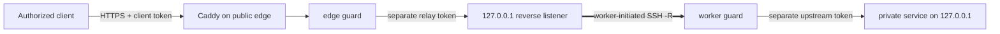

[English](../README.md) · [العربية](README.ar.md) · [Español](README.es.md) · [Français](README.fr.md) · [日本語](README.ja.md) · [한국어](README.ko.md) · [Tiếng Việt](README.vi.md) · [中文 (简体)](README.zh-Hans.md) · [中文（繁體）](README.zh-Hant.md) · [Deutsch](README.de.md) · [Русский](README.ru.md)

[](https://github.com/lachlanchen/lachlanchen/blob/main/figs/banner.png)

# LazyEdge

*Une passerelle légère, vérifiable et fermée par défaut, pour qu'un serveur public utilise un calcul privé en toute sécurité.*

[](https://lazying.art) [](https://www.npmjs.com/package/@lazyingart/lazyedge) [](https://github.com/lachlanchen/LazyEdge/actions/workflows/ci.yml) [](../package.json) [](../LICENSE) [](https://github.com/sponsors/lachlanchen)

LazyEdge résout l'asymétrie de connectivité : votre station peut joindre un serveur cloud, mais ce serveur ne peut pas revenir à travers le NAT domestique. Le worker ouvre un tunnel inverse OpenSSH sortant ; la passerelle ne publie que des contrats HTTPS relus, définis par hôte + méthode + chemin, au moyen de Caddy et de deux gardes qui séparent les identifiants. LocalLLM, Whisper, SoVITS ou tout autre service HTTP explicitement approuvé reste sur la boucle locale.

> **Promesse de confidentialité :** **LazyEdge n'envoie aucune télémétrie, ne découvre aucun service et n'expose aucune cible non déclarée. Seules les routes explicitement déclarées dans le manifeste peuvent être générées. Le contenu des requêtes ne transite que par les points de terminaison de passerelle et de worker que vous configurez, et LazyEdge ne conserve pas les corps de requêtes.** Le proxy, le journal système, le service amont ou le fournisseur cloud configuré peut appliquer sa propre politique de journalisation ; consultez le [modèle de menace](../docs/security.md).

| Donate | PayPal | Stripe |
| --- | --- | --- |
| [](https://chat.lazying.art/donate) | [](https://paypal.me/RongzhouChen) | [](https://buy.stripe.com/aFadR8gIaflgfQV6T4fw400) |

## Fonctionnement



- **Sortant d'abord :** le worker privé initie la connexion ; aucune redirection de port du routeur domestique n'est nécessaire.
- **Boucle locale à chaque frontière :** les ports bruts du modèle, du tunnel, du worker, de CDP, de VNC et de noVNC ne deviennent jamais des cibles publiques.
- **Politique exacte :** domaine, méthode et chemin sont autorisés explicitement ; tout trafic non déclaré est refusé à la passerelle et au worker.
- **Séparation des identifiants :** les identifiants client, relais, amont et SSH sont différents et restent hors du manifeste.
- **Transport remplaçable :** OpenSSH en premier ; le contrat applicatif reste découplé d'un futur transport WireGuard, rathole ou frp.
- **Passerelle migrable :** générez le même projet relu sur un second cloud, connectez-le en parallèle, testez, puis déplacez le DNS.

LazyEdge répond au même type de besoin qu'un tunnel inverse façon ngrok, mais reste volontairement plus étroit : la v0.1 publie des routes d'API HTTP relues, pas des ports TCP arbitraires ni des URL publiques improvisées. Consultez les [concepts à grande échelle](../docs/concepts-at-scale.md) pour situer les technologies.

## Démarrage rapide

Node.js 20 ou version ultérieure est requis. Commencez localement ; n'appliquez aucun fichier de production généré avant d'avoir lu le plan et le [guide de sécurité](../docs/security.md).

```bash
npx @lazyingart/lazyedge --help
mkdir my-edge
cd my-edge
npx @lazyingart/lazyedge init --output lazyedge.yaml
npx @lazyingart/lazyedge validate --config ./lazyedge.yaml
npx @lazyingart/lazyedge plan --config ./lazyedge.yaml
```

Générez ensuite chaque artefact pour le relire :

```bash
npx @lazyingart/lazyedge render caddy --config ./lazyedge.yaml
npx @lazyingart/lazyedge render openssh --config ./lazyedge.yaml \
  --identity-file "$HOME/.config/lazyedge/ssh/id_ed25519" \
  --known-hosts-file "$HOME/.config/lazyedge/ssh/known_hosts"
npx @lazyingart/lazyedge render accounts --config ./lazyedge.yaml \
  --public-key-file "$HOME/.config/lazyedge/ssh/id_ed25519.pub"
npx @lazyingart/lazyedge render systemd --config ./lazyedge.yaml
```

La commande Caddy ci-dessus utilise HTTPS automatique. Ajoutez `--manual-certificates` uniquement pour une arborescence Certbot existante sous `/etc/letsencrypt/live/<host>/`. Le générateur de comptes exige une clé publique Ed25519 dédiée ; les chemins OpenSSH désignent les fichiers privés du worker sans en copier le contenu. La commande systemd produit un lot de vérification étiqueté ou accepte `--component edge|worker|tunnel|caddy|redirect|certbot` pour une seule section.

Séparez les liaisons par frontière de confiance : placez l'[exemple edge](../examples/local-llm/bindings.edge.example.yaml) uniquement sur la passerelle publique et l'[exemple worker](../examples/local-llm/bindings.worker.example.yaml) uniquement sur le calcul privé. Chaque processus ne lit que les identifiants de son rôle ; aucun n'a besoin du magasin d'identifiants de l'autre.

Après le démarrage, exécutez `doctor --role edge` dans le cloud et `doctor --role worker` sur le calcul privé ; utilisez `all` uniquement si les deux rôles sont réellement colocalisés. Les commandes root `render redirect-helper` et `render nat --direction apply|rollback` impriment des artefacts de vérification portant une marque de propriété dérivée du condensat du manifeste ; elles ne modifient jamais le pare-feu. Consultez [l'exploitation](../docs/operations.md).

L'interface `v1alpha1` est expérimentale. La version 0.1 ne fournit pas de `apply`, `rollback` ou `uninstall` distant : les générateurs écrivent des artefacts vérifiables, qu'un administrateur installe délibérément. Consultez le [guide complet](../docs/quickstart.md).

## Contenu

| Chemin | Contenu |
| --- | --- |
| [`bin/`](../bin/) et [`src/`](../src/) | CLI, validation du manifeste, gardes, cycle des jetons et générateurs |
| [`schemas/`](../schemas/) | contrat `EdgeProject` lisible par machine |
| [`templates/`](../templates/) | blocs générés pour Caddy, OpenSSH et systemd |
| [`examples/`](../examples/) | exemples sans secret pour LocalLLM et HTTP générique, avec des liaisons séparées pour l'[edge](../examples/local-llm/bindings.edge.example.yaml) et le [worker](../examples/local-llm/bindings.worker.example.yaml) |
| [`docs/`](../docs/) | guides d'architecture, sécurité, exploitation, migration et apprentissage |
| [`i18n/`](../i18n/) | présentations traduites du dépôt |
| `references/private/` | notes machine sans secret, ignorées et exclues de npm ; ce n'est pas un coffre d'identifiants |

## Documentation

- [Architecture et parcours d'une requête](../docs/architecture.md)
- [Référence de configuration](../docs/configuration.md)
- [Sécurité et modèle de menace](../docs/security.md)
- [Exploitation et retour arrière](../docs/operations.md)
- [Migration Alibaba → Huawei ou double passerelle](../docs/migration.md)
- [Intégration LocalLLM + AgInTi](../docs/integrations/local-llm-aginti.md)
- [Dépannage](../docs/troubleshooting.md)
- [Lien avec les grands systèmes multiserveurs](../docs/concepts-at-scale.md)

## Développement et validation

```bash
npm ci
npm test
npm run check
npm run pack:dry-run
git diff --check
```

Examinez la liste des fichiers du paquet npm simulé. Une version ne doit contenir ni `references/private/`, ni `.env`, ni identifiants, clés, jetons, journaux, état d'exécution, profils de navigateur ou caches. Toute contribution sensible à la sécurité doit comporter un test négatif ; lisez [CONTRIBUTING.md](../CONTRIBUTING.md) et [SECURITY.md](../SECURITY.md).

## Citation

Si vous utilisez LazyEdge dans une recherche, citez le dépôt. GitHub lit [CITATION.cff](../CITATION.cff) et affiche un panneau **Cite this repository** sur la page du dépôt.

```bibtex
@software{chen_lazyedge_2026,
  author = {Chen, Lachlan},
  title = {LazyEdge: A default-deny edge for private compute},
  year = {2026},
  url = {https://github.com/lachlanchen/LazyEdge}
}
```

## État

**Aperçu v0.1.** L'interface publique peut évoluer. Ce dépôt décrit la base de sécurité visée ; il ne prétend pas qu'un domaine, serveur cloud, tunnel, paquet npm ou déploiement LocalLLM particulier est actif avant vérification indépendante de cet environnement. N'utilisez pas LazyEdge comme unique protection d'un système sensible ou critique pour la sécurité.

MIT © [Lachlan Chen](https://github.com/lachlanchen)
