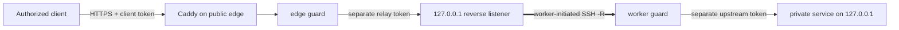

[English](../README.md) · [العربية](README.ar.md) · [Español](README.es.md) · [Français](README.fr.md) · [日本語](README.ja.md) · [한국어](README.ko.md) · [Tiếng Việt](README.vi.md) · [中文 (简体)](README.zh-Hans.md) · [中文（繁體）](README.zh-Hant.md) · [Deutsch](README.de.md) · [Русский](README.ru.md)

[](https://github.com/lachlanchen/lachlanchen/blob/main/figs/banner.png)

# LazyEdge

*公開サーバーから非公開の計算資源を安全に利用するための、小さく監査可能なデフォルト拒否型エッジ。*

[](https://lazying.art) [](https://www.npmjs.com/package/@lazyingart/lazyedge) [](https://github.com/lachlanchen/LazyEdge/actions/workflows/ci.yml) [](../package.json) [](../LICENSE) [](https://github.com/sponsors/lachlanchen)

LazyEdge は到達性の非対称性を解決します。ワークステーションからクラウドサーバーへは接続できても、サーバー側から家庭内 NAT を越えて戻ることはできません。非公開ワーカーが外向きの OpenSSH リバーストンネルを開き、エッジは Caddy と認証情報を分離する二つのガードを通じて、レビュー済みの HTTPS ホスト + メソッド + パス契約だけを公開します。LocalLLM、Whisper、SoVITS、または明示的に許可した HTTP サービスはローカルのループバックに残ります。

> **プライバシーに関する約束：** **LazyEdge はテレメトリを送信せず、サービスを探索せず、宣言されていない接続先を公開しません。生成できるのは、マニフェストで明示的に宣言したルートだけです。リクエスト内容は設定したゲートウェイとワーカーのエンドポイントだけを通過し、LazyEdge はリクエスト本文を永続化しません。** 設定したプロキシ、システムジャーナル、上流サービス、クラウド事業者には独自のログ方針があり得ます。[脅威モデル](../docs/security.md)を確認してください。

| Donate | PayPal | Stripe |
| --- | --- | --- |
| [](https://chat.lazying.art/donate) | [](https://paypal.me/RongzhouChen) | [](https://buy.stripe.com/aFadR8gIaflgfQV6T4fw400) |

## 仕組み



- **外向き接続が起点：** 非公開ワーカーが接続を開始するため、家庭用ルーターのポート転送は不要です。
- **全境界でループバック：** 生のモデル、トンネル、ワーカー、CDP、VNC、noVNC のポートは公開先になりません。
- **厳密なポリシー：** ドメイン、メソッド、パスを許可リスト化し、宣言されていない通信をエッジとワーカーの両方で拒否します。
- **認証情報の分離：** クライアント、リレー、上流、SSH の認証情報は別々で、マニフェスト外に置きます。
- **交換可能な転送層：** まず OpenSSH を使用し、アプリケーション契約は将来の WireGuard、rathole、frp から分離します。
- **移行可能なエッジ：** 同じレビュー済みプロジェクトを別のクラウドで生成し、並行接続して検証した後に DNS を移します。
- **任意のプライベートチャット（v0.2 プレビュー）：** 専用の loopback BFF が、既定で明るい/ダークのインストール可能な PWA、増分テキストストリーミング、任意のログイン保持とブラウザーのパスワードマネージャー対応、安全な Markdown と同一オリジンのオフライン KaTeX を提供します。API トークンと生のモデルルートはサーバー側に残ります。

LazyEdge は ngrok 型リバーストンネルと同じ問題領域を扱いますが、意図的に範囲を限定しています。v0.2 プレビューが公開するのはレビュー済み HTTP API ルートであり、任意の TCP ポートやその場限りの公開 URL ではありません。技術の位置付けは[大規模システムの概念](../docs/concepts-at-scale.md)を参照してください。

## クイックスタート

Node.js 20 以降が必要です。まずローカルで開始し、計画と[セキュリティガイド](../docs/security.md)を読むまでは、生成した本番ファイルを適用しないでください。

```bash
npx @lazyingart/lazyedge --help
mkdir my-edge
cd my-edge
npx @lazyingart/lazyedge init --output lazyedge.yaml
npx @lazyingart/lazyedge validate --config ./lazyedge.yaml
npx @lazyingart/lazyedge plan --config ./lazyedge.yaml
```

次に各成果物を生成してレビューします。

```bash
npx @lazyingart/lazyedge render caddy --config ./lazyedge.yaml
npx @lazyingart/lazyedge render openssh --config ./lazyedge.yaml \
  --identity-file "$HOME/.config/lazyedge/ssh/id_ed25519" \
  --known-hosts-file "$HOME/.config/lazyedge/ssh/known_hosts"
npx @lazyingart/lazyedge render accounts --config ./lazyedge.yaml \
  --public-key-file "$HOME/.config/lazyedge/ssh/id_ed25519.pub"
npx @lazyingart/lazyedge render systemd --config ./lazyedge.yaml
```

上の Caddy コマンドは Automatic HTTPS を使用します。既存の Certbot 構成が `/etc/letsencrypt/live/<host>/` にある場合だけ `--manual-certificates` を追加してください。アカウントレンダラーには専用 Ed25519 公開鍵が必要です。OpenSSH のパスはワーカー上の非公開ファイルを指すだけで、内容を複製しません。systemd コマンドは見出し付きレビュー用バンドルを出力し、`--component edge|worker|tunnel|caddy|redirect|certbot|chat` で一つのセクションも選べます。

バインディングは信頼境界ごとに分離してください。[edge の例](../examples/local-llm/bindings.edge.example.yaml)は公開ゲートウェイだけに、[worker の例](../examples/local-llm/bindings.worker.example.yaml)は非公開計算ホストだけに置きます。各ランタイムは自分の役割に必要な認証情報だけを読み、相手側の認証情報ストアを必要としません。

起動後はクラウドで `doctor --role edge`、非公開計算ホストで `doctor --role worker` を実行し、両ロールが本当に同居する場合だけ `all` を使います。root 用の `render redirect-helper` と `render nat --direction apply|rollback` は、マニフェストダイジェスト由来の所有タグ付きレビュー成果物を出力するだけで、ファイアウォールを変更しません。[運用ガイド](../docs/operations.md)を参照してください。

`v1alpha1` インターフェースはプレビューです。バージョン 0.2 はリモートの `apply`、`rollback`、`uninstall` を提供しません。レンダラーがレビュー可能な成果物を書き出し、管理者が意図的に導入します。[完全なクイックスタート](../docs/quickstart.md)も参照してください。

## 収録内容

| パス | 内容 |
| --- | --- |
| [`bin/`](../bin/) と [`src/`](../src/) | CLI、マニフェスト検証、ガード、トークンのライフサイクル、レンダラー |
| [`schemas/`](../schemas/) | 機械可読な `EdgeProject` 契約 |
| [`templates/`](../templates/) | 生成される Caddy、OpenSSH、systemd の構成要素 |
| [`examples/`](../examples/) | 秘密情報を含まない LocalLLM と汎用 HTTP の例（[edge](../examples/local-llm/bindings.edge.example.yaml) と [worker](../examples/local-llm/bindings.worker.example.yaml) のバインディングを分離） |
| [`docs/`](../docs/) | アーキテクチャ、セキュリティ、運用、移行、学習ガイド |
| [`i18n/`](../i18n/) | 翻訳版リポジトリ紹介 |
| `references/private/` | Git と npm から除外された、秘密情報を含まないマシン固有メモ。認証情報保管庫ではありません |

## ドキュメント

- [アーキテクチャとリクエスト経路](../docs/architecture.md)
- [設定リファレンス](../docs/configuration.md)
- [セキュリティと脅威モデル](../docs/security.md)
- [運用とロールバック](../docs/operations.md)
- [Alibaba → Huawei またはデュアルエッジ移行](../docs/migration.md)
- [LocalLLM + AgInTi 連携](../docs/integrations/local-llm-aginti.md)
- [トラブルシューティング](../docs/troubleshooting.md)
- [大規模な複数サーバーシステムとの関係](../docs/concepts-at-scale.md)

## 開発と検証

```bash
npm ci
npm test
npm run check
npm run pack:dry-run
git diff --check
```

npm ドライランのファイル一覧を確認してください。リリースには `references/private/`、`.env`、認証情報、鍵、トークン、ログ、実行状態、ブラウザプロファイル、キャッシュを含めてはいけません。セキュリティに関わる変更には否定系テストを追加してください。[CONTRIBUTING.md](../CONTRIBUTING.md) と [SECURITY.md](../SECURITY.md)も参照してください。

## 引用

研究で LazyEdge を使用する場合は、このリポジトリを引用してください。GitHub は [CITATION.cff](../CITATION.cff) を読み込み、リポジトリページに **Cite this repository** パネルを表示します。

```bibtex
@software{chen_lazyedge_2026,
  author = {Chen, Lachlan},
  title = {LazyEdge: A default-deny edge for private compute},
  year = {2026},
  url = {https://github.com/lachlanchen/LazyEdge}
}
```

## 状態

**v0.2 プレビュー。** 公開インターフェースは変更される可能性があります。このリポジトリは意図する安全な基準を示すものであり、特定のドメイン、クラウドサーバー、トンネル、npm バージョン、LocalLLM 配備が稼働中であるとは、その環境を独立に検証するまで主張しません。機密性の高いシステムや安全上重要なシステムを守る唯一の制御として LazyEdge を使用しないでください。

MIT © [Lachlan Chen](https://github.com/lachlanchen)
