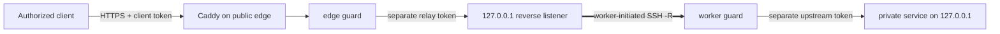

[English](../README.md) · [العربية](README.ar.md) · [Español](README.es.md) · [Français](README.fr.md) · [日本語](README.ja.md) · [한국어](README.ko.md) · [Tiếng Việt](README.vi.md) · [中文 (简体)](README.zh-Hans.md) · [中文（繁體）](README.zh-Hant.md) · [Deutsch](README.de.md) · [Русский](README.ru.md)

[](https://github.com/lachlanchen/lachlanchen/blob/main/figs/banner.png)

# LazyEdge

*공개 서버가 비공개 연산 자원을 안전하게 사용하도록 만드는 작고 감사 가능한 기본 거부형 엣지.*

[](https://lazying.art) [](https://www.npmjs.com/package/@lazyingart/lazyedge) [](https://github.com/lachlanchen/LazyEdge/actions/workflows/ci.yml) [](../package.json) [](../LICENSE) [](https://github.com/sponsors/lachlanchen)

LazyEdge는 비대칭 연결 문제를 해결합니다. 워크스테이션은 클라우드 서버에 접속할 수 있지만 서버는 가정용 NAT를 거슬러 워크스테이션에 접속할 수 없습니다. 비공개 워커가 외부 방향 OpenSSH 역방향 터널을 열고, 엣지는 Caddy와 자격 증명을 분리하는 두 가드를 통해 검토된 HTTPS 호스트 + 메서드 + 경로 계약만 공개합니다. LocalLLM, Whisper, SoVITS 또는 명시적으로 허용한 HTTP 서비스는 로컬 루프백에 남습니다.

> **개인정보 보호 약속:** **LazyEdge는 원격 측정 데이터를 보내거나 서비스를 탐색하거나 선언되지 않은 대상을 노출하지 않습니다. 매니페스트에 명시적으로 선언한 경로만 생성할 수 있습니다. 요청 내용은 사용자가 설정한 게이트웨이와 워커 엔드포인트만 통과하며 LazyEdge는 요청 본문을 영구 저장하지 않습니다.** 설정한 프록시, 시스템 저널, 업스트림 또는 클라우드 제공자는 자체 로깅 정책을 가질 수 있으므로 [위협 모델](../docs/security.md)을 확인하세요.

| Donate | PayPal | Stripe |
| --- | --- | --- |
| [](https://chat.lazying.art/donate) | [](https://paypal.me/RongzhouChen) | [](https://buy.stripe.com/aFadR8gIaflgfQV6T4fw400) |

## 작동 방식



- **외부 연결 우선:** 비공개 워커가 연결을 시작하므로 가정용 라우터의 포트 포워딩이 필요 없습니다.
- **모든 경계에서 루프백:** 원시 모델, 터널, 워커, CDP, VNC, noVNC 포트는 절대 공개 대상이 되지 않습니다.
- **정확한 정책:** 도메인, 메서드, 경로를 허용 목록에 넣고 선언하지 않은 트래픽을 엣지와 워커 모두에서 거부합니다.
- **자격 증명 분리:** 클라이언트, 릴레이, 업스트림, SSH 자격 증명은 서로 다르며 매니페스트 밖에 둡니다.
- **교체 가능한 전송 계층:** 먼저 OpenSSH를 사용하고 애플리케이션 계약은 향후 WireGuard, rathole, frp 전송과 분리합니다.
- **이전 가능한 엣지:** 동일하게 검토된 프로젝트를 두 번째 클라우드에 렌더링하고 병렬 연결로 시험한 뒤 DNS를 옮깁니다.

LazyEdge는 ngrok형 역방향 터널과 같은 문제 영역을 다루지만 의도적으로 범위가 더 좁습니다. v0.1은 검토된 HTTP API 경로만 공개하며 임의의 TCP 포트나 즉석 공개 URL을 제공하지 않습니다. 기술 지형은 [대규모 개념](../docs/concepts-at-scale.md)을 참고하세요.

## 빠른 시작

Node.js 20 이상이 필요합니다. 로컬에서 시작하고 계획과 [보안 가이드](../docs/security.md)를 읽기 전에는 생성된 운영 파일을 적용하지 마세요.

```bash
npx @lazyingart/lazyedge --help
mkdir my-edge
cd my-edge
npx @lazyingart/lazyedge init --output lazyedge.yaml
npx @lazyingart/lazyedge validate --config ./lazyedge.yaml
npx @lazyingart/lazyedge plan --config ./lazyedge.yaml
```

그런 다음 각 산출물을 렌더링하여 검토합니다.

```bash
npx @lazyingart/lazyedge render caddy --config ./lazyedge.yaml
npx @lazyingart/lazyedge render openssh --config ./lazyedge.yaml \
  --identity-file "$HOME/.config/lazyedge/ssh/id_ed25519" \
  --known-hosts-file "$HOME/.config/lazyedge/ssh/known_hosts"
npx @lazyingart/lazyedge render accounts --config ./lazyedge.yaml \
  --public-key-file "$HOME/.config/lazyedge/ssh/id_ed25519.pub"
npx @lazyingart/lazyedge render systemd --config ./lazyedge.yaml
```

위 Caddy 명령은 Automatic HTTPS를 사용합니다. `/etc/letsencrypt/live/<host>/`에 기존 Certbot 구성이 있을 때만 `--manual-certificates`를 추가하세요. 계정 렌더러에는 전용 Ed25519 공개 키가 필요하며, OpenSSH 경로는 워커의 비공개 파일을 가리킬 뿐 내용을 복사하지 않습니다. systemd 명령은 레이블이 붙은 검토 번들을 출력하고 `--component edge|worker|tunnel|caddy|redirect|certbot`으로 한 섹션만 선택할 수 있습니다.

바인딩을 신뢰 경계별로 분리하세요. [edge 예제](../examples/local-llm/bindings.edge.example.yaml)는 공개 게이트웨이에만, [worker 예제](../examples/local-llm/bindings.worker.example.yaml)는 비공개 연산 호스트에만 둡니다. 각 런타임은 자기 역할의 자격 증명만 읽으며 상대 역할의 자격 증명 저장소는 필요하지 않습니다.

시작 후 클라우드에서는 `doctor --role edge`, 비공개 연산 호스트에서는 `doctor --role worker`를 실행하고 두 역할이 실제로 같은 호스트에 있을 때만 `all`을 사용하세요. root 전용 `render redirect-helper`와 `render nat --direction apply|rollback`은 매니페스트 다이제스트 기반 소유 태그가 있는 검토 산출물만 출력하며 방화벽을 변경하지 않습니다. [운영 가이드](../docs/operations.md)를 참고하세요.

`v1alpha1` 인터페이스는 미리보기 단계입니다. 버전 0.1은 원격 `apply`, `rollback`, `uninstall`을 제공하지 않습니다. 렌더러가 검토 가능한 산출물을 만들고 관리자가 의도적으로 설치합니다. 전체 [빠른 시작 가이드](../docs/quickstart.md)를 참고하세요.

## 포함 내용

| 경로 | 내용 |
| --- | --- |
| [`bin/`](../bin/) 및 [`src/`](../src/) | CLI, 매니페스트 검증, 가드, 토큰 수명 주기, 렌더러 |
| [`schemas/`](../schemas/) | 기계 판독 가능한 `EdgeProject` 계약 |
| [`templates/`](../templates/) | 생성되는 Caddy, OpenSSH, systemd 구성 요소 |
| [`examples/`](../examples/) | 비밀 없는 LocalLLM 및 일반 HTTP 예제와 분리된 [edge](../examples/local-llm/bindings.edge.example.yaml)/[worker](../examples/local-llm/bindings.worker.example.yaml) 바인딩 |
| [`docs/`](../docs/) | 아키텍처, 보안, 운영, 이전, 학습 가이드 |
| [`i18n/`](../i18n/) | 번역된 저장소 소개 |
| `references/private/` | Git에서 무시되고 npm에서 제외되는 비밀 없는 장비 메모. 자격 증명 저장소가 아닙니다 |

## 문서

- [아키텍처와 요청 흐름](../docs/architecture.md)
- [설정 참조](../docs/configuration.md)
- [보안 및 위협 모델](../docs/security.md)
- [운영 및 롤백](../docs/operations.md)
- [Alibaba → Huawei 또는 이중 엣지 이전](../docs/migration.md)
- [LocalLLM + AgInTi 통합](../docs/integrations/local-llm-aginti.md)
- [문제 해결](../docs/troubleshooting.md)
- [대규모 다중 서버 시스템과의 관계](../docs/concepts-at-scale.md)

## 개발 및 검증

```bash
npm ci
npm test
npm run check
npm run pack:dry-run
git diff --check
```

npm 드라이런의 파일 목록을 검사하세요. 릴리스에는 `references/private/`, `.env`, 자격 증명, 키, 토큰, 로그, 런타임 상태, 브라우저 프로필, 캐시가 들어가면 안 됩니다. 보안 관련 기여에는 부정 테스트를 포함해야 합니다. [CONTRIBUTING.md](../CONTRIBUTING.md)와 [SECURITY.md](../SECURITY.md)를 읽어 주세요.

## 인용

연구에서 LazyEdge를 사용한다면 이 저장소를 인용하세요. GitHub는 [CITATION.cff](../CITATION.cff)를 읽고 저장소 페이지에 **Cite this repository** 패널을 표시합니다.

```bibtex
@software{chen_lazyedge_2026,
  author = {Chen, Lachlan},
  title = {LazyEdge: A default-deny edge for private compute},
  year = {2026},
  url = {https://github.com/lachlanchen/LazyEdge}
}
```

## 상태

**v0.1 미리보기.** 공개 인터페이스는 변경될 수 있습니다. 이 저장소는 의도한 안전 기준을 설명하며, 특정 도메인, 클라우드 서버, 터널, npm 버전 또는 LocalLLM 배포가 실제로 작동한다고 독립 검증 전에 주장하지 않습니다. 민감하거나 안전이 중요한 시스템을 보호하는 유일한 통제로 LazyEdge를 사용하지 마세요.

MIT © [Lachlan Chen](https://github.com/lachlanchen)
