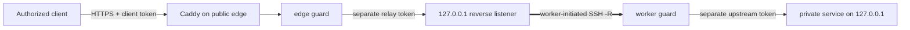

[English](../README.md) · [العربية](README.ar.md) · [Español](README.es.md) · [Français](README.fr.md) · [日本語](README.ja.md) · [한국어](README.ko.md) · [Tiếng Việt](README.vi.md) · [中文 (简体)](README.zh-Hans.md) · [中文（繁體）](README.zh-Hant.md) · [Deutsch](README.de.md) · [Русский](README.ru.md)

[](https://github.com/lachlanchen/lachlanchen/blob/main/figs/banner.png)

# LazyEdge

*Небольшой, проверяемый и закрытый по умолчанию edge-шлюз для безопасного использования частных вычислительных ресурсов публичным сервером.*

[](https://lazying.art) [](https://www.npmjs.com/package/@lazyingart/lazyedge) [](https://github.com/lachlanchen/LazyEdge/actions/workflows/ci.yml) [](../package.json) [](../LICENSE) [](https://github.com/sponsors/lachlanchen)

LazyEdge решает проблему асимметричной доступности: рабочая станция может обратиться к облачному серверу, но сервер не может установить обратное соединение через домашний NAT. Частный worker открывает исходящий обратный туннель OpenSSH; edge публикует только проверенные HTTPS-контракты вида хост + метод + путь через Caddy и два защитных слоя с раздельными учётными данными. LocalLLM, Whisper, SoVITS или другой явно разрешённый HTTP-сервис остаётся на локальном loopback-интерфейсе.

> **Обещание конфиденциальности:** **LazyEdge не отправляет телеметрию, не обнаруживает сервисы автоматически и не публикует необъявленные цели. Могут быть созданы только маршруты, явно описанные в манифесте. Содержимое запросов проходит исключительно через настроенные вами конечные точки шлюза и worker, а LazyEdge не сохраняет тела запросов.** Настроенный прокси, системный журнал, вышестоящий сервис или облачный провайдер может вести собственные журналы; ознакомьтесь с [моделью угроз](../docs/security.md).

| Donate | PayPal | Stripe |
| --- | --- | --- |
| [](https://chat.lazying.art/donate) | [](https://paypal.me/RongzhouChen) | [](https://buy.stripe.com/aFadR8gIaflgfQV6T4fw400) |

## Как это работает



- **Сначала исходящее соединение:** частный worker инициирует подключение; перенаправление порта на домашнем маршрутизаторе не требуется.
- **Loopback на каждой границе:** необработанные порты модели, туннеля, worker, CDP, VNC и noVNC никогда не становятся публичными целями.
- **Точная политика:** домен, метод и путь перечисляются явно; edge и worker отклоняют весь необъявленный трафик.
- **Разделение учётных данных:** данные клиента, relay, upstream и SSH различны и хранятся вне манифеста.
- **Заменяемый транспорт:** сначала OpenSSH; контракт приложения отделён от будущего транспорта WireGuard, rathole или frp.
- **Переносимый edge:** создайте тот же проверенный проект во втором облаке, подключите и протестируйте его параллельно, затем переключите DNS.

LazyEdge решает похожую задачу, что и обратный туннель в стиле ngrok, но намеренно имеет более узкую область: preview v0.3 публикует проверенные маршруты HTTP API, а не произвольные TCP-порты или временные публичные URL. Общую карту технологий см. в разделе [концепции в масштабе](../docs/concepts-at-scale.md).

## Быстрый старт

Требуется Node.js 20 или новее. Начните локально; не применяйте созданные производственные файлы, пока не изучите план и [руководство по безопасности](../docs/security.md).

```bash
npx @lazyingart/lazyedge --help
mkdir my-edge
cd my-edge
npx @lazyingart/lazyedge init --output lazyedge.yaml
npx @lazyingart/lazyedge validate --config ./lazyedge.yaml
npx @lazyingart/lazyedge plan --config ./lazyedge.yaml
```

Затем создайте каждый артефакт для проверки:

```bash
npx @lazyingart/lazyedge render caddy --config ./lazyedge.yaml
npx @lazyingart/lazyedge render openssh --config ./lazyedge.yaml \
  --identity-file "$HOME/.config/lazyedge/ssh/id_ed25519" \
  --known-hosts-file "$HOME/.config/lazyedge/ssh/known_hosts"
npx @lazyingart/lazyedge render accounts --config ./lazyedge.yaml \
  --public-key-file "$HOME/.config/lazyedge/ssh/id_ed25519.pub"
npx @lazyingart/lazyedge render systemd --config ./lazyedge.yaml
```

Приведённая команда Caddy использует Automatic HTTPS. Добавляйте `--manual-certificates` только для существующей структуры Certbot в `/etc/letsencrypt/live/<host>/`. Генератор учётных записей требует отдельный открытый ключ Ed25519; пути OpenSSH ссылаются на закрытые файлы worker и не копируют их содержимое. Команда systemd выдаёт размеченный пакет для проверки либо принимает `--component edge|worker|tunnel|caddy|redirect|certbot` для одного раздела.

Разделяйте привязки по границе доверия: размещайте [пример edge](../examples/local-llm/bindings.edge.example.yaml) только на публичном шлюзе, а [пример worker](../examples/local-llm/bindings.worker.example.yaml) — только на частном вычислительном узле. Каждый процесс читает лишь учётные данные своей роли; хранилище другой роли ему не требуется.

После запуска выполняйте `doctor --role edge` в облаке, а `doctor --role worker` на частном вычислительном узле; используйте `all` только при реальном совмещении ролей. Root-команды `render redirect-helper` и `render nat --direction apply|rollback` лишь печатают проверяемые артефакты с меткой владельца, производной от хеша манифеста, и никогда не изменяют межсетевой экран. См. [эксплуатацию](../docs/operations.md).

Интерфейс `v1alpha1` имеет статус preview. Версия 0.3 не предоставляет удалённые `apply`, `rollback` или `uninstall`: генераторы создают проверяемые артефакты, которые администратор устанавливает осознанно. См. [полное руководство по запуску](../docs/quickstart.md).

## Содержимое

| Путь | Содержимое |
| --- | --- |
| [`bin/`](../bin/) и [`src/`](../src/) | CLI, проверка манифеста, защитные слои, жизненный цикл токенов и генераторы |
| [`schemas/`](../schemas/) | машиночитаемый контракт `EdgeProject` |
| [`templates/`](../templates/) | генерируемые блоки Caddy, OpenSSH и systemd |
| [`examples/`](../examples/) | примеры LocalLLM и общего HTTP без секретов с раздельными привязками для [edge](../examples/local-llm/bindings.edge.example.yaml) и [worker](../examples/local-llm/bindings.worker.example.yaml) |
| [`docs/`](../docs/) | руководства по архитектуре, безопасности, эксплуатации, миграции и обучению |
| [`i18n/`](../i18n/) | переведённые описания репозитория |
| `references/private/` | не содержащие секретов заметки о машинах, игнорируемые Git и исключённые из npm; это не хранилище учётных данных |

## Документация

- [Архитектура и путь запроса](../docs/architecture.md)
- [Справочник конфигурации](../docs/configuration.md)
- [Безопасность и модель угроз](../docs/security.md)
- [Эксплуатация и откат](../docs/operations.md)
- [Миграция Alibaba → Huawei или dual-edge](../docs/migration.md)
- [OpenAI-совместимые клиенты](../docs/integrations/openai-compatible-clients.md)
- [Устранение неполадок](../docs/troubleshooting.md)
- [Связь с крупными многосерверными системами](../docs/concepts-at-scale.md)

## Разработка и проверка

```bash
npm ci
npm test
npm run check
npm run pack:dry-run
git diff --check
```

Проверьте список файлов пробной npm-упаковки. Релиз не должен содержать `references/private/`, `.env`, учётные данные, ключи, токены, журналы, состояние выполнения, профили браузера или кэши. Изменения, затрагивающие безопасность, должны включать негативный тест; прочитайте [CONTRIBUTING.md](../CONTRIBUTING.md) и [SECURITY.md](../SECURITY.md).

## Цитирование

Если вы используете LazyEdge в исследовании, процитируйте репозиторий. GitHub читает [CITATION.cff](../CITATION.cff) и показывает панель **Cite this repository** на странице репозитория.

```bibtex
@software{chen_lazyedge_2026,
  author = {Chen, Lachlan},
  title = {LazyEdge: A default-deny edge for private compute},
  year = {2026},
  url = {https://github.com/lachlanchen/LazyEdge}
}
```

## Статус

**Предварительная версия v0.3.** Публичный интерфейс может измениться. Репозиторий описывает предполагаемую безопасную основу; он не утверждает, что конкретный домен, облачный сервер, туннель, npm-версия или развёртывание LocalLLM уже работают, пока эта среда не проверена независимо. Не используйте LazyEdge как единственную защиту чувствительных или критичных для безопасности систем.

MIT © [Lachlan Chen](https://github.com/lachlanchen)
