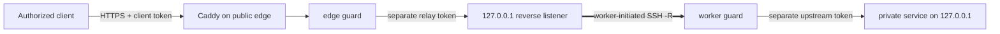

[English](../README.md) · [العربية](README.ar.md) · [Español](README.es.md) · [Français](README.fr.md) · [日本語](README.ja.md) · [한국어](README.ko.md) · [Tiếng Việt](README.vi.md) · [中文 (简体)](README.zh-Hans.md) · [中文（繁體）](README.zh-Hant.md) · [Deutsch](README.de.md) · [Русский](README.ru.md)

[](https://github.com/lachlanchen/lachlanchen/blob/main/figs/banner.png)

# LazyEdge

*Một edge nhỏ gọn, có thể kiểm tra và mặc định từ chối, giúp máy chủ công khai sử dụng tài nguyên tính toán riêng tư một cách an toàn.*

[](https://lazying.art) [](https://www.npmjs.com/package/@lazyingart/lazyedge) [](https://github.com/lachlanchen/LazyEdge/actions/workflows/ci.yml) [](../package.json) [](../LICENSE) [](https://github.com/sponsors/lachlanchen)

LazyEdge giải quyết khả năng kết nối bất đối xứng: máy trạm có thể truy cập máy chủ đám mây, nhưng máy chủ không thể gọi ngược xuyên qua NAT gia đình. Worker riêng tư mở đường hầm ngược OpenSSH theo chiều đi ra; edge chỉ công khai các hợp đồng HTTPS đã được duyệt theo host + phương thức + đường dẫn qua Caddy và hai lớp bảo vệ tách biệt thông tin xác thực. LocalLLM, Whisper, SoVITS hoặc một dịch vụ HTTP được cho phép rõ ràng vẫn nằm trên loopback cục bộ.

> **Cam kết quyền riêng tư:** **LazyEdge không gửi dữ liệu đo từ xa, không tự khám phá dịch vụ và không để lộ đích chưa khai báo. Chỉ các tuyến được khai báo rõ ràng trong manifest mới có thể được tạo. Nội dung yêu cầu chỉ đi qua các endpoint gateway và worker do bạn cấu hình, và LazyEdge không lưu lâu dài phần thân yêu cầu.** Proxy, nhật ký hệ thống, upstream hoặc nhà cung cấp đám mây mà bạn cấu hình có thể có chính sách ghi log riêng; hãy đọc [mô hình đe dọa](../docs/security.md).

| Donate | PayPal | Stripe |
| --- | --- | --- |
| [](https://chat.lazying.art/donate) | [](https://paypal.me/RongzhouChen) | [](https://buy.stripe.com/aFadR8gIaflgfQV6T4fw400) |

## Cách hoạt động



- **Kết nối đi ra trước:** worker riêng tư khởi tạo kết nối; không cần chuyển tiếp cổng trên bộ định tuyến gia đình.
- **Loopback ở mọi ranh giới:** cổng thô của mô hình, đường hầm, worker, CDP, VNC và noVNC không bao giờ trở thành đích công khai.
- **Chính sách chính xác:** domain, phương thức và đường dẫn được đưa vào danh sách cho phép; lưu lượng chưa khai báo bị từ chối ở cả edge và worker.
- **Tách thông tin xác thực:** thông tin client, relay, upstream và SSH khác nhau và nằm ngoài manifest.
- **Transport có thể thay thế:** bắt đầu với OpenSSH; hợp đồng ứng dụng vẫn tách rời khỏi WireGuard, rathole hoặc frp trong tương lai.
- **Edge dễ di chuyển:** render cùng dự án đã duyệt trên đám mây thứ hai, kết nối song song, kiểm tra rồi mới chuyển DNS.

LazyEdge giải quyết cùng nhóm vấn đề với đường hầm ngược kiểu ngrok nhưng cố ý có phạm vi hẹp hơn: bản xem trước v0.3 chỉ công khai các tuyến HTTP API đã duyệt, không mở cổng TCP tùy ý hay URL công khai phát sinh. Xem [các khái niệm ở quy mô lớn](../docs/concepts-at-scale.md) để hiểu bản đồ công nghệ.

## Bắt đầu nhanh

Cần Node.js 20 trở lên. Hãy bắt đầu cục bộ; đừng áp dụng các tệp production được tạo trước khi đọc kế hoạch và [hướng dẫn bảo mật](../docs/security.md).

```bash
npx @lazyingart/lazyedge --help
mkdir my-edge
cd my-edge
npx @lazyingart/lazyedge init --output lazyedge.yaml
npx @lazyingart/lazyedge validate --config ./lazyedge.yaml
npx @lazyingart/lazyedge plan --config ./lazyedge.yaml
```

Sau đó render từng artefact để xem xét:

```bash
npx @lazyingart/lazyedge render caddy --config ./lazyedge.yaml
npx @lazyingart/lazyedge render openssh --config ./lazyedge.yaml \
  --identity-file "$HOME/.config/lazyedge/ssh/id_ed25519" \
  --known-hosts-file "$HOME/.config/lazyedge/ssh/known_hosts"
npx @lazyingart/lazyedge render accounts --config ./lazyedge.yaml \
  --public-key-file "$HOME/.config/lazyedge/ssh/id_ed25519.pub"
npx @lazyingart/lazyedge render systemd --config ./lazyedge.yaml
```

Lệnh Caddy ở trên dùng Automatic HTTPS. Chỉ thêm `--manual-certificates` khi đã có bố cục Certbot tại `/etc/letsencrypt/live/<host>/`. Bộ render tài khoản yêu cầu khóa công khai Ed25519 chuyên dụng; các đường dẫn OpenSSH chỉ trỏ tới tệp riêng tư trên worker và không sao chép nội dung. Lệnh systemd tạo gói xem xét có nhãn hoặc nhận `--component edge|worker|tunnel|caddy|redirect|certbot` để xuất một phần.

Hãy tách binding theo ranh giới tin cậy: chỉ đặt [ví dụ edge](../examples/local-llm/bindings.edge.example.yaml) trên cổng công khai và [ví dụ worker](../examples/local-llm/bindings.worker.example.yaml) trên máy tính riêng. Mỗi tiến trình chỉ đọc thông tin xác thực cho vai trò của mình; không vai trò nào cần kho thông tin xác thực của vai trò kia.

Sau khi khởi động, chạy `doctor --role edge` trên đám mây và `doctor --role worker` trên máy tính riêng; chỉ dùng `all` khi hai vai trò thực sự cùng máy. Các lệnh root `render redirect-helper` và `render nat --direction apply|rollback` chỉ in artefact xem xét với nhãn sở hữu lấy từ digest của manifest, không thực thi thay đổi tường lửa. Xem [vận hành](../docs/operations.md).

Giao diện `v1alpha1` đang ở trạng thái preview. Phiên bản 0.3 không cung cấp `apply`, `rollback` hoặc `uninstall` từ xa: bộ render tạo artefact có thể xem xét và quản trị viên chủ động cài đặt chúng. Xem [hướng dẫn bắt đầu đầy đủ](../docs/quickstart.md).

## Nội dung hiện có

| Đường dẫn | Nội dung |
| --- | --- |
| [`bin/`](../bin/) và [`src/`](../src/) | CLI, kiểm tra manifest, các guard, vòng đời token và bộ render |
| [`schemas/`](../schemas/) | hợp đồng `EdgeProject` có thể đọc bằng máy |
| [`templates/`](../templates/) | khối cấu hình Caddy, OpenSSH và systemd được tạo |
| [`examples/`](../examples/) | ví dụ LocalLLM và HTTP tổng quát không chứa bí mật, với binding [edge](../examples/local-llm/bindings.edge.example.yaml) và [worker](../examples/local-llm/bindings.worker.example.yaml) riêng biệt |
| [`docs/`](../docs/) | hướng dẫn kiến trúc, bảo mật, vận hành, di chuyển và học tập |
| [`i18n/`](../i18n/) | phần giới thiệu kho mã đã dịch |
| `references/private/` | ghi chú máy không chứa bí mật, bị Git bỏ qua và loại khỏi npm; không phải kho thông tin xác thực |

## Tài liệu

- [Kiến trúc và luồng yêu cầu](../docs/architecture.md)
- [Tham chiếu cấu hình](../docs/configuration.md)
- [Bảo mật và mô hình đe dọa](../docs/security.md)
- [Vận hành và rollback](../docs/operations.md)
- [Di chuyển Alibaba → Huawei hoặc dual-edge](../docs/migration.md)
- [Client tương thích OpenAI](../docs/integrations/openai-compatible-clients.md)
- [Khắc phục sự cố](../docs/troubleshooting.md)
- [Quan hệ với hệ thống nhiều máy chủ quy mô lớn](../docs/concepts-at-scale.md)

## Phát triển và xác minh

```bash
npm ci
npm test
npm run check
npm run pack:dry-run
git diff --check
```

Hãy kiểm tra danh sách tệp của bản chạy thử npm. Bản phát hành không được chứa `references/private/`, `.env`, thông tin xác thực, khóa, token, log, trạng thái runtime, hồ sơ trình duyệt hoặc cache. Mọi đóng góp nhạy cảm về bảo mật nên có kiểm thử phủ định; đọc [CONTRIBUTING.md](../CONTRIBUTING.md) và [SECURITY.md](../SECURITY.md).

## Trích dẫn

Nếu sử dụng LazyEdge trong nghiên cứu, hãy trích dẫn kho mã. GitHub đọc [CITATION.cff](../CITATION.cff) và hiển thị bảng **Cite this repository** trên trang kho mã.

```bibtex
@software{chen_lazyedge_2026,
  author = {Chen, Lachlan},
  title = {LazyEdge: A default-deny edge for private compute},
  year = {2026},
  url = {https://github.com/lachlanchen/LazyEdge}
}
```

## Trạng thái

**Bản xem trước v0.3.** Giao diện công khai có thể thay đổi. Kho mã này mô tả nền tảng an toàn dự kiến; nó không tuyên bố bất kỳ domain, máy chủ đám mây, đường hầm, phiên bản npm hay triển khai LocalLLM cụ thể nào đang hoạt động trước khi môi trường đó được xác minh độc lập. Không dùng LazyEdge làm lớp bảo vệ duy nhất cho hệ thống nhạy cảm hoặc quan trọng về an toàn.

MIT © [Lachlan Chen](https://github.com/lachlanchen)
