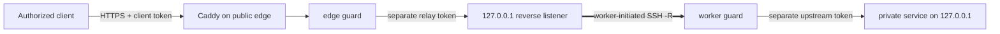

[English](../README.md) · [العربية](README.ar.md) · [Español](README.es.md) · [Français](README.fr.md) · [日本語](README.ja.md) · [한국어](README.ko.md) · [Tiếng Việt](README.vi.md) · [中文 (简体)](README.zh-Hans.md) · [中文（繁體）](README.zh-Hant.md) · [Deutsch](README.de.md) · [Русский](README.ru.md)

[](https://github.com/lachlanchen/lachlanchen/blob/main/figs/banner.png)

# LazyEdge

*一个小巧、可审计、默认拒绝的边缘网关，让公网服务器安全使用私有算力。*

[](https://lazying.art) [](https://www.npmjs.com/package/@lazyingart/lazyedge) [](https://github.com/lachlanchen/LazyEdge/actions/workflows/ci.yml) [](../package.json) [](../LICENSE) [](https://github.com/sponsors/lachlanchen)

LazyEdge 解决非对称可达性问题：你的工作站可以访问云服务器，但云服务器无法反向穿过家庭 NAT 找到工作站。私有 worker 主动建立出站 OpenSSH 反向隧道；边缘端通过 Caddy 和两个分离凭据的守卫，只公开经过审查的 HTTPS 主机名 + 方法 + 路径契约。LocalLLM、Whisper、SoVITS 或其他明确批准的 HTTP 服务仍只监听本机回环地址。

> **隐私承诺：** **LazyEdge 不发送遥测数据，不自动发现服务，也不暴露任何未声明的目标。它只能生成清单中明确声明的路由。请求内容只会经过你配置的网关和 worker 端点，LazyEdge 不会持久保存请求正文。** 你配置的代理、系统日志、上游服务或云提供商可能有自己的日志策略；请阅读[威胁模型](../docs/security.md)。

| Donate | PayPal | Stripe |
| --- | --- | --- |
| [](https://chat.lazying.art/donate) | [](https://paypal.me/RongzhouChen) | [](https://buy.stripe.com/aFadR8gIaflgfQV6T4fw400) |

## 工作原理



- **从出站连接开始：** 私有 worker 主动发起连接，无需在家庭路由器上做端口转发。
- **所有边界均为回环：** 原始模型、隧道、worker、CDP、VNC 和 noVNC 端口绝不会成为公网目标。
- **精确策略：** 逐一允许域名、HTTP 方法和路径；边缘端与 worker 都拒绝未声明流量。
- **凭据分离：** 客户端、内部中继、上游服务和 SSH 凭据彼此不同，并全部放在清单之外。
- **可替换传输层：** 首先支持 OpenSSH；应用契约与未来的 WireGuard、rathole 或 frp 传输解耦。
- **可迁移边缘：** 在第二个云上渲染同一份已审查项目，并行连接并测试，然后再切换 DNS。

LazyEdge 与 ngrok 式反向隧道解决相似问题，但有意缩小范围：v0.1 只公开经过审查的 HTTP API 路由，不开放任意 TCP 端口，也不生成临时公网 URL。请阅读[大规模系统概念](../docs/concepts-at-scale.md)了解技术全貌。

## 快速开始

需要 Node.js 20 或更高版本。请先在本地开始；阅读计划和[安全指南](../docs/security.md)之前，不要应用生成的生产文件。

```bash
npx @lazyingart/lazyedge --help
mkdir my-edge
cd my-edge
npx @lazyingart/lazyedge init --output lazyedge.yaml
npx @lazyingart/lazyedge validate --config ./lazyedge.yaml
npx @lazyingart/lazyedge plan --config ./lazyedge.yaml
```

然后渲染每个产物并逐一审查：

```bash
npx @lazyingart/lazyedge render caddy --config ./lazyedge.yaml
npx @lazyingart/lazyedge render openssh --config ./lazyedge.yaml \
  --identity-file "$HOME/.config/lazyedge/ssh/id_ed25519" \
  --known-hosts-file "$HOME/.config/lazyedge/ssh/known_hosts"
npx @lazyingart/lazyedge render accounts --config ./lazyedge.yaml \
  --public-key-file "$HOME/.config/lazyedge/ssh/id_ed25519.pub"
npx @lazyingart/lazyedge render systemd --config ./lazyedge.yaml
```

上面的 Caddy 命令使用 Automatic HTTPS。只有边缘端已经采用 `/etc/letsencrypt/live/<host>/` 的 Certbot 布局时，才添加 `--manual-certificates`。账户渲染器要求专用 Ed25519 公钥；OpenSSH 路径只引用 worker 上的私有文件，不会复制其内容。systemd 命令输出带标签的审查包，也可用 `--component edge|worker|tunnel|caddy|redirect|certbot` 只渲染一个部分。

请按信任边界拆分绑定文件：仅在公网网关放置 [edge 示例](../examples/local-llm/bindings.edge.example.yaml)，仅在私有计算机放置 [worker 示例](../examples/local-llm/bindings.worker.example.yaml)。每个运行时只读取本角色所需的凭据，不需要另一角色的凭据存储。

启动后，请在云端运行 `doctor --role edge`，在私有计算机运行 `doctor --role worker`；只有两个角色确实位于同一主机时才使用 `all`。root 专用的 `render redirect-helper` 与 `render nat --direction apply|rollback` 只输出带清单摘要所有权标签的审查产物，绝不会执行防火墙变更。详见[运维](../docs/operations.md)。

`v1alpha1` 接口仍处于预览阶段。0.1 版不提供远程 `apply`、`rollback` 或 `uninstall`；渲染器只输出可审查的产物，由管理员有意识地安装。详见[完整快速上手](../docs/quickstart.md)。

## 当前内容

| 路径 | 内容 |
| --- | --- |
| [`bin/`](../bin/) 与 [`src/`](../src/) | CLI、清单验证、守卫、令牌生命周期和渲染器 |
| [`schemas/`](../schemas/) | 机器可读的 `EdgeProject` 契约 |
| [`templates/`](../templates/) | 生成的 Caddy、OpenSSH 与 systemd 构件 |
| [`examples/`](../examples/) | 不含秘密的 LocalLLM 与通用 HTTP 示例，包括分离的 [edge](../examples/local-llm/bindings.edge.example.yaml) 与 [worker](../examples/local-llm/bindings.worker.example.yaml) 绑定 |
| [`docs/`](../docs/) | 架构、安全、运维、迁移和教学指南 |
| [`i18n/`](../i18n/) | 多语言项目介绍 |
| `references/private/` | 被 Git 忽略且不进入 npm 的无秘密机器笔记；它不是凭据库 |

## 文档

- [架构与请求路径](../docs/architecture.md)
- [配置参考](../docs/configuration.md)
- [安全与威胁模型](../docs/security.md)
- [运维与回滚](../docs/operations.md)
- [Alibaba → Huawei 或双边缘迁移](../docs/migration.md)
- [LocalLLM + AgInTi 集成](../docs/integrations/local-llm-aginti.md)
- [故障排查](../docs/troubleshooting.md)
- [与大型多服务器系统的关系](../docs/concepts-at-scale.md)

## 开发与验证

```bash
npm ci
npm test
npm run check
npm run pack:dry-run
git diff --check
```

检查 npm 试打包的文件清单。发布包不得包含 `references/private/`、`.env`、凭据、密钥、令牌、日志、运行状态、浏览器配置或缓存。涉及安全的贡献应包含反向测试；请阅读 [CONTRIBUTING.md](../CONTRIBUTING.md) 和 [SECURITY.md](../SECURITY.md)。

## 引用

如果在研究中使用 LazyEdge，请引用本仓库。GitHub 会读取 [CITATION.cff](../CITATION.cff)，并在仓库页面显示 **Cite this repository** 面板。

```bibtex
@software{chen_lazyedge_2026,
  author = {Chen, Lachlan},
  title = {LazyEdge: A default-deny edge for private compute},
  year = {2026},
  url = {https://github.com/lachlanchen/LazyEdge}
}
```

## 状态

**v0.1 预览版。** 公共接口可能变化。本仓库描述预期的安全基线；在独立验证具体环境之前，不会宣称任何特定域名、云服务器、隧道、npm 版本或 LocalLLM 部署已经上线。不要把 LazyEdge 作为敏感或安全关键系统的唯一防护。

MIT © [Lachlan Chen](https://github.com/lachlanchen)
