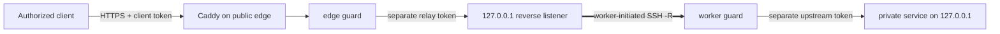

[English](../README.md) · [العربية](README.ar.md) · [Español](README.es.md) · [Français](README.fr.md) · [日本語](README.ja.md) · [한국어](README.ko.md) · [Tiếng Việt](README.vi.md) · [中文 (简体)](README.zh-Hans.md) · [中文（繁體）](README.zh-Hant.md) · [Deutsch](README.de.md) · [Русский](README.ru.md)

[](https://github.com/lachlanchen/lachlanchen/blob/main/figs/banner.png)

# LazyEdge

*一個小巧、可稽核、預設拒絕的邊緣閘道，讓公開伺服器安全使用私有運算資源。*

[](https://lazying.art) [](https://www.npmjs.com/package/@lazyingart/lazyedge) [](https://github.com/lachlanchen/LazyEdge/actions/workflows/ci.yml) [](../package.json) [](../LICENSE) [](https://github.com/sponsors/lachlanchen)

LazyEdge 解決非對稱可達性問題：你的工作站可以連上雲端伺服器，但伺服器無法反向穿過家用 NAT 找到工作站。私有 worker 主動建立向外的 OpenSSH 反向通道；邊緣端透過 Caddy 與兩個分隔憑證的守衛，只公開經審查的 HTTPS 主機名 + 方法 + 路徑契約。LocalLLM、Whisper、SoVITS 或其他明確核准的 HTTP 服務仍只監聽本機迴環位址。

> **隱私承諾：** **LazyEdge 不傳送遙測資料、不自動探索服務，也不公開任何未宣告的目標。它只能產生清單中明確宣告的路由。請求內容只會經過你設定的閘道與 worker 端點，LazyEdge 不會持久保存請求本文。** 你設定的代理、系統日誌、上游服務或雲端供應商可能有自己的記錄政策；請閱讀[威脅模型](../docs/security.md)。

| Donate | PayPal | Stripe |
| --- | --- | --- |
| [](https://chat.lazying.art/donate) | [](https://paypal.me/RongzhouChen) | [](https://buy.stripe.com/aFadR8gIaflgfQV6T4fw400) |

## 運作方式



- **由外向連線開始：** 私有 worker 主動發起連線，不必在家用路由器設定連接埠轉送。
- **所有邊界皆為迴環：** 原始模型、通道、worker、CDP、VNC 與 noVNC 連接埠絕不成為公開目標。
- **精確政策：** 逐一允許網域、HTTP 方法與路徑；邊緣端和 worker 都會拒絕未宣告的流量。
- **憑證分隔：** 用戶端、中繼、上游與 SSH 憑證彼此不同，且都放在清單之外。
- **可替換傳輸層：** 先採用 OpenSSH；應用程式契約與未來的 WireGuard、rathole 或 frp 傳輸解耦。
- **可遷移邊緣：** 在第二個雲端產生同一份已審查專案，平行連線並測試後再切換 DNS。
- **可選私有聊天（v0.2 預覽）：** 專用 loopback BFF 提供預設明亮/深色的可安裝 PWA、逐步文字串流、可選擇的記住登入和瀏覽器密碼管理員支援，以及安全 Markdown 與同源離線 KaTeX；API token 與原始模型路由始終留在伺服器端。

LazyEdge 與 ngrok 式反向通道處理相似問題，但刻意縮小範圍：v0.2 預覽只公開經過審查的 HTTP API 路由，不開放任意 TCP 連接埠，也不產生臨時公開 URL。請閱讀[大規模系統概念](../docs/concepts-at-scale.md)了解技術全貌。

## 快速開始

需要 Node.js 20 或更新版本。請先從本機開始；閱讀計畫與[安全指南](../docs/security.md)前，不要套用產生的正式環境檔案。

```bash
npx @lazyingart/lazyedge --help
mkdir my-edge
cd my-edge
npx @lazyingart/lazyedge init --output lazyedge.yaml
npx @lazyingart/lazyedge validate --config ./lazyedge.yaml
npx @lazyingart/lazyedge plan --config ./lazyedge.yaml
```

接著產生每項成果並逐一審查：

```bash
npx @lazyingart/lazyedge render caddy --config ./lazyedge.yaml
npx @lazyingart/lazyedge render openssh --config ./lazyedge.yaml \
  --identity-file "$HOME/.config/lazyedge/ssh/id_ed25519" \
  --known-hosts-file "$HOME/.config/lazyedge/ssh/known_hosts"
npx @lazyingart/lazyedge render accounts --config ./lazyedge.yaml \
  --public-key-file "$HOME/.config/lazyedge/ssh/id_ed25519.pub"
npx @lazyingart/lazyedge render systemd --config ./lazyedge.yaml
```

上面的 Caddy 指令使用 Automatic HTTPS。只有邊緣端已採用 `/etc/letsencrypt/live/<host>/` 的 Certbot 配置時，才加入 `--manual-certificates`。帳號轉譯器要求專用 Ed25519 公開金鑰；OpenSSH 路徑只引用 worker 上的私有檔案，不會複製內容。systemd 指令輸出帶標籤的審查包，也可用 `--component edge|worker|tunnel|caddy|redirect|certbot|chat` 只產生一個部分。

請依信任邊界拆分綁定檔案：只在公網閘道放置 [edge 範例](../examples/local-llm/bindings.edge.example.yaml)，只在私有運算主機放置 [worker 範例](../examples/local-llm/bindings.worker.example.yaml)。每個執行程序只讀取本身角色所需的憑證，不需要另一角色的憑證儲存區。

啟動後，請在雲端執行 `doctor --role edge`，在私有運算主機執行 `doctor --role worker`；只有兩個角色確實位於同一主機時才使用 `all`。root 專用的 `render redirect-helper` 與 `render nat --direction apply|rollback` 只輸出帶清單摘要所有權標籤的審查成果，絕不執行防火牆變更。詳見[維運](../docs/operations.md)。

`v1alpha1` 介面仍是預覽版。0.2 版不提供遠端 `apply`、`rollback` 或 `uninstall`；轉譯器只輸出可審查的成果，由管理員有意識地安裝。詳見[完整快速入門](../docs/quickstart.md)。

## 目前內容

| 路徑 | 內容 |
| --- | --- |
| [`bin/`](../bin/) 與 [`src/`](../src/) | CLI、清單驗證、守衛、權杖生命週期與轉譯器 |
| [`schemas/`](../schemas/) | 機器可讀的 `EdgeProject` 契約 |
| [`templates/`](../templates/) | 產生的 Caddy、OpenSSH 與 systemd 構件 |
| [`examples/`](../examples/) | 不含祕密的 LocalLLM 與一般 HTTP 範例，包括分離的 [edge](../examples/local-llm/bindings.edge.example.yaml) 與 [worker](../examples/local-llm/bindings.worker.example.yaml) 綁定 |
| [`docs/`](../docs/) | 架構、安全、維運、遷移與教學指南 |
| [`i18n/`](../i18n/) | 多語言專案介紹 |
| `references/private/` | 被 Git 忽略且不進入 npm 的無祕密機器筆記；它不是憑證庫 |

## 文件

- [架構與請求路徑](../docs/architecture.md)
- [設定參考](../docs/configuration.md)
- [安全與威脅模型](../docs/security.md)
- [維運與回復](../docs/operations.md)
- [Alibaba → Huawei 或雙邊緣遷移](../docs/migration.md)
- [LocalLLM + AgInTi 整合](../docs/integrations/local-llm-aginti.md)
- [疑難排解](../docs/troubleshooting.md)
- [與大型多伺服器系統的關係](../docs/concepts-at-scale.md)

## 開發與驗證

```bash
npm ci
npm test
npm run check
npm run pack:dry-run
git diff --check
```

檢查 npm 試打包的檔案清單。發行套件不得包含 `references/private/`、`.env`、憑證、金鑰、權杖、日誌、執行狀態、瀏覽器設定檔或快取。涉及安全的貢獻應包含反向測試；請閱讀 [CONTRIBUTING.md](../CONTRIBUTING.md) 與 [SECURITY.md](../SECURITY.md)。

## 引用

若在研究中使用 LazyEdge，請引用本儲存庫。GitHub 會讀取 [CITATION.cff](../CITATION.cff)，並在儲存庫頁面顯示 **Cite this repository** 面板。

```bibtex
@software{chen_lazyedge_2026,
  author = {Chen, Lachlan},
  title = {LazyEdge: A default-deny edge for private compute},
  year = {2026},
  url = {https://github.com/lachlanchen/LazyEdge}
}
```

## 狀態

**v0.2 預覽版。** 公開介面可能變動。本儲存庫描述預期的安全基準；在獨立驗證具體環境以前，不會聲稱任何特定網域、雲端伺服器、通道、npm 版本或 LocalLLM 部署已經上線。不要把 LazyEdge 當成敏感或安全關鍵系統的唯一防護。

MIT © [Lachlan Chen](https://github.com/lachlanchen)
